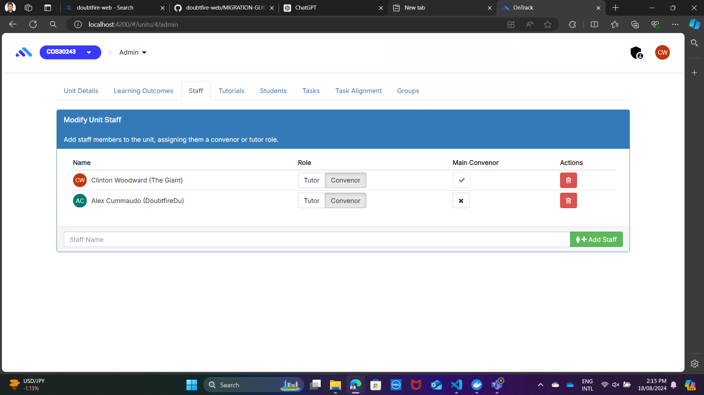

# Component Review - Unit Staff Editor

## Student Name: Atharv Bhandare

## Student ID: 223650012

## Component Name

File Name: unit-staff-editor.coffee
1. unit-staff-editor.coffee
2. unit-staff-editor.tpl.html

## Component purpose

The purpose of this component is to allow main convenor modify the unit staff by adding staff members to the unit, and assigning them a tutor or convenor role.

**Screenshots:**
Before Migration: 

## Component outcomes/interactions

1. Note: To interact with this feature, you have to login via username: aconvenor & password: password.
2. It lets main convenor to add a new staff to a unit.
3. It lets main convenor to delete a staff from the unit.
4. This component allows main convenor to change the role of the staff.

**Component migration plan:**
**Migration Steps:**

1. For the migration I will be looking over the below migration guide:
   - [doubtfire-web's Migration Guide](https://github.com/thoth-tech/doubtfire-web/blob/e70f4c7cd1395eaab942ee389788f75f92e985c9/MIGRATION-GUIDE.md)

2. **Setup Angular Environment:**
   - Ensure the Angular project is properly set up.
   - Install the necessary dependencies (e.g., Angular Material).

3. **Analyze the Existing Component:**
    - Review the current implementation of the existing component.
    - Understand the logic behind each functionality and how it is integrated with the html file.

4. **Create Angular Component:**
   - Generate a new Angular component.
   - Transfer the HTML template, styles, and logic from the coffeescript to typescript.

5. **Integrate Services:**
   - Migrate and integrate the `UnitStaffEditor` into the new Angular component.

6. **Testing:**
   - Test the new component to ensure it replicates the behavior of the old one.
   - Fix any issues that arise during testing.

**Component migration Check list** – What is needs to be checked for this component to work once
migrated?

[ ] ability to add staff.

[ ] ability to change the staff role.

[ ] ability to delete the staff.

