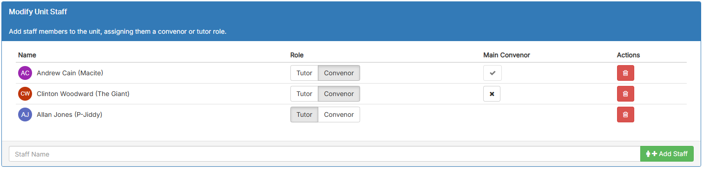

# OnTrack Component Review

## Team Member

Chee Yu Koh

## Component

`unit-staff-editor`

Relevant files:

- `unit-details-editor.coffee`
- `unit-staff-editor.tpl.html`

## Component Purpose

The unit-staff-editor component is designed to manage staff members for a specific unit in the application. It provides functionality to:

1. Add new staff members to a unit.
2. Assign roles to staff members (e.g., Tutor or Convenor).
3. Designate a main convenor for the unit.
4. Remove staff members from a unit.

This component is critical for unit management and ensures that the correct roles and responsibilities are assigned within the context of the application's workflow.

`unit-staff-editor`

## Component Outcomes and Interactions

**Expected Outcomes:**

- Users can view the list of assigned staff for a unit.
- Users can add new staff members and assign them roles.
- Users can update staff roles and assign the main convenor.
- Users can remove staff from the unit.
**Interactions:**
Inputs:
- Staff data retrieved from the backend or cache (`staffCache`).
- User input for adding new staff via a typeahead search field.
Outputs:
- API calls for updating staff roles, adding staff, or removing staff:
- `newUnitRoleService.update()` for role updates.
- `newUnitRoleService.delete()` for staff removal.
- `$scope.unit.addStaff()` for adding new staff.
Dependencies:
- `alertService` for showing success or error messages.
- `newUnitRoleService` for role-related API operations.
- `$scope.unit.staffCache` for retrieving and updating staff data.

## Component Migration Plan

The migration plan involves reviewing similar tabular components, such as the `unit-students-editor` component, which have already been migrated to TypeScript and Material UI. This review will help identify best practices, patterns, and reusable solutions to ensure consistency across components. The migration process will closely follow the [doubtfire-web's Migration Guide](https://github.com/thoth-tech/doubtfire-web/blob/e70f4c7cd1395eaab942ee389788f75f92e985c9/MIGRATION-GUIDE.md), which outlines steps for setting up Angular Material components, applying Tailwind CSS for responsive and modern design, and migrating logic to TypeScript. The plan also includes thorough testing of functionality, including interactions with parent components, role updates, and error handling, to ensure the `unit-staff-editor` component is fully functional, visually consistent, and seamlessly integrated into the application. This structured approach ensures both adherence to project standards and high-quality implementation.

## Component Review Checklist

[ ] Displays the list of assigned staff correctly. 
[ ] Allows adding new staff members via typeahead. 
[ ] Enables role assignment (Tutor, Convenor). 
[ ] Handles assigning the main convenor.
[ ] Allows removing staff members.
[ ] Shows appropriate success/error messages.
[ ] Follows coding standards (Angular 17 + TypeScript).
[ ] Uses Material UI and Tailwind CSS for styling.
[ ] Fully tested with working parent components.
