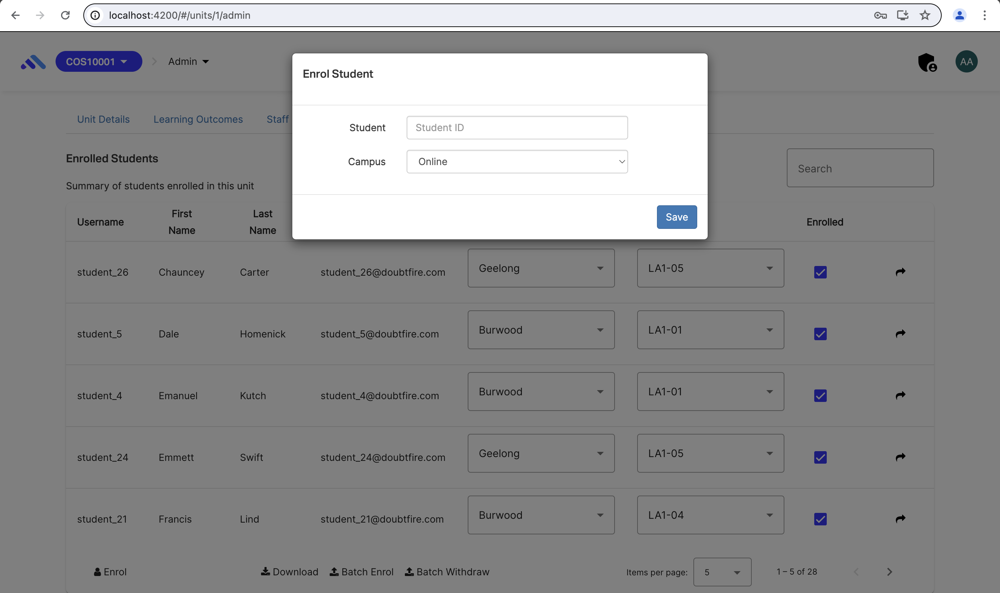
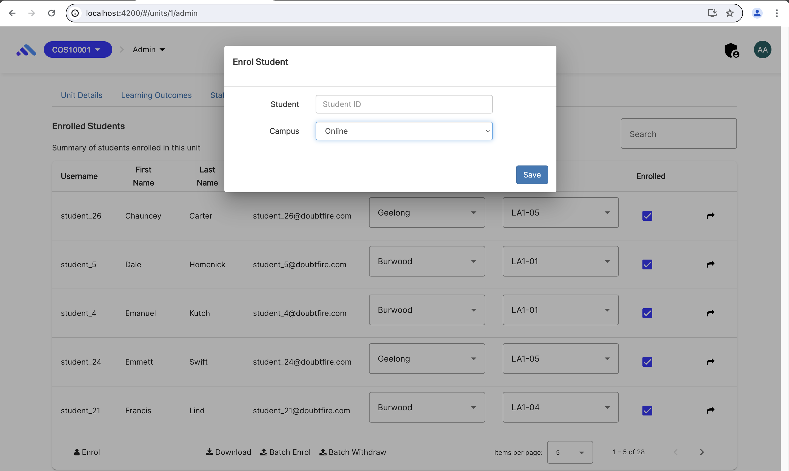
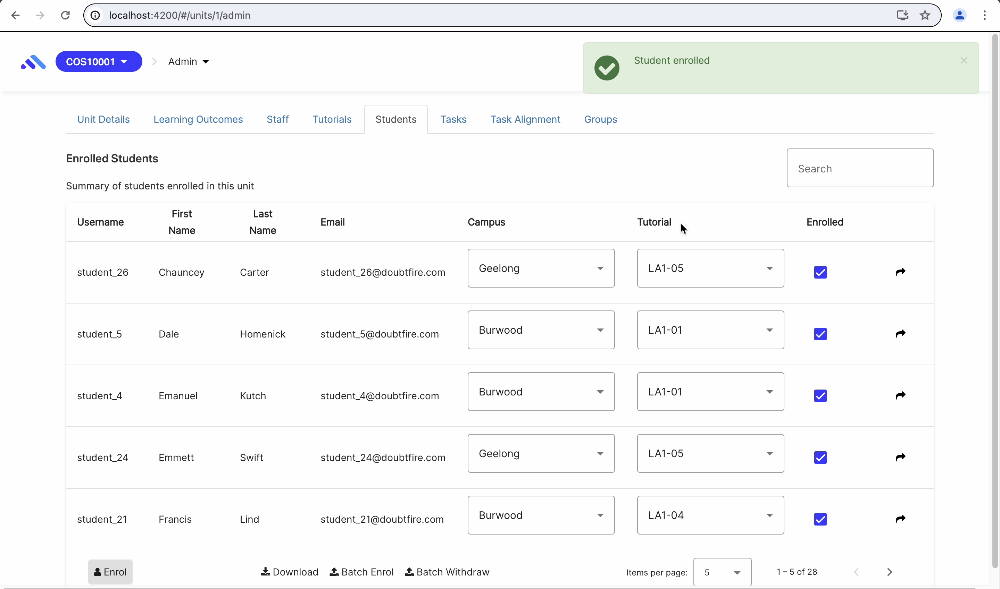
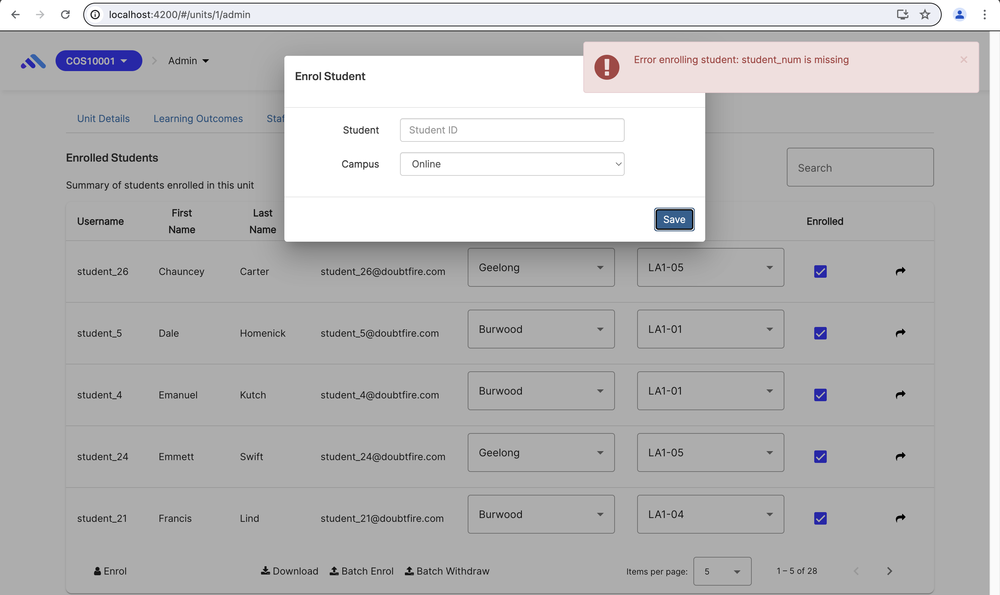

# OnTrack Component Review

## Team Member

Minh Tho DUONG - s223749059

Unit SIT782 Team Project B: Execution and Delivery - Trimester 1, 2024.

## Component

`unit-student-enrolment-modal`

Relevant files:

- `unit-student-enrolment-modal.component.html`
- `unit-student-enrolment-modal.component.ts`
- `unit-student-enrolment-modal.service.ts`

## Component Purpose

The unit-student-enrolment-modal component is used in aadmin and aconvenor account privileges to enrol a student with studentId and campus. It is located in the Administration section when users select a specific unit and click on the Students tab. In that, there is a Enrol icon where users can enter information about the studentId and campus name.

## Component Outcomes and Interactions

The expected outcome of the component is to provide a user-friendly interface, allowing the user to enrol a student with basic information and filters.

## Component Migration Plan

The migration plan is followed from learning resources (/doubtfire-web/MIGRATION-GUIDE.md) to review and migrate CoffeeScript files in the component into TypeScript and Angular. There is no modification on the component design.

## Component Post-Migration

The work required to migrate the component is complete. All CoffeeScript sections in the component is removed with TypeScript files. The unit-student-enrolment-modal component runs with necessary utilities.

