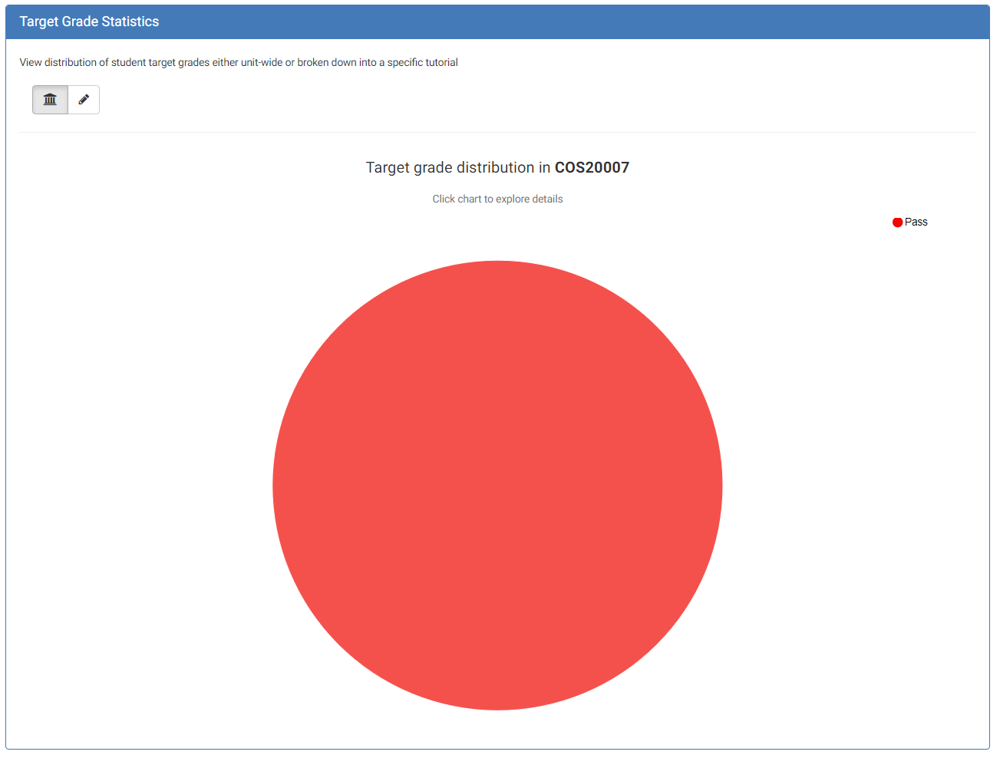
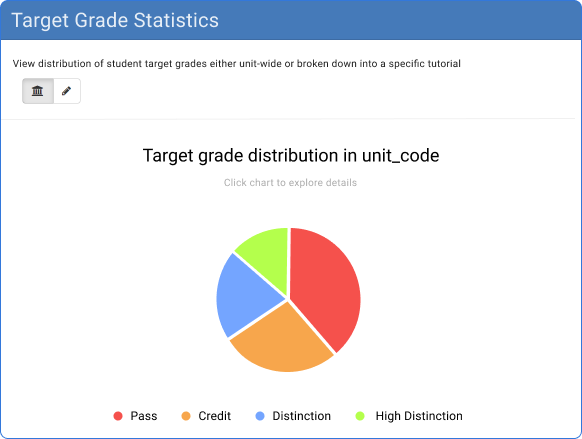

**Student Name: Dylan Sutherland**

**Student ID: 220243462**

**Term: T1 2023 – SIT 374**

**Ontrack Component review check**

First select a component to review from the list below:

[https://deakin365.sharepoint.com/:x:/r/sites/ThothTech2/Shared%20Documents/OnTrack%20-%20UI%20Enhancement/T3\_2022/Management%20%5BT3\_2022%5D/selected\_task(revised).xlsx?d=wac02013da5224c958ac60fd96fac7b20&csf=1&web=1&e=UfCmZ5](https://deakin365.sharepoint.com/:x:/r/sites/ThothTech2/Shared%20Documents/OnTrack%20-%20UI%20Enhancement/T3_2022/Management%20%5BT3_2022%5D/selected_task(revised).xlsx?d=wac02013da5224c958ac60fd96fac7b20&csf=1&web=1&e=UfCmZ5)

**Component Name**

Target Grade Pie Chart

- target-grade-pie-chart.coffee

**Component purpose**

Displays a pie chart visualisation of target grades.

**Component outcomes/interactions**

The expected outcome is a pie chart visualising the distribution of target grades. The pie chart will display the proportion of each target grade in the input data as a slice of the chart, with labels showing the percentage of each slice relative to the total. The component also includes options to customize the chart's appearance, including a legend and the chart's dimensions. Each grade is coloured according to the legend.

**Component migration plan -** Add your plan for the migration, how will you do this, what steps are needed. Add some sketches or diagrams, what will the migrated component look like compared to the current one.

1. Create new Typescript file target-grade-pie-chart.component.ts and define the new component.
2. Update the scope bindings
3. Update the controller by replacing AngularJS services with Angular equivalents
4. Update the chart options
5. Test the component

`target-grade-pie-chart-mockup`

**Component review checklist** – What is needs to be checked for this component to work once migrated?

Once migrated the component should render a pie chart with different colors for each status category.  It should display the percentage of tasks in each category and a legend indicating the meaning of each color. The chart should be responsive and adjust its size based on the available space. The component should be able to accept an input of an array of data containing the number of tasks in each category. It should update the chart dynamically when the input data changes. The component should also handle cases where there are no tasks in a particular category and display the corresponding label with a value of zero.

**Discussion with Client (Andrew Cain)**

See if the component is still needed and present this document so Andrew can review if all the outcomes and interactions are correct prior to the migration and build of this component.