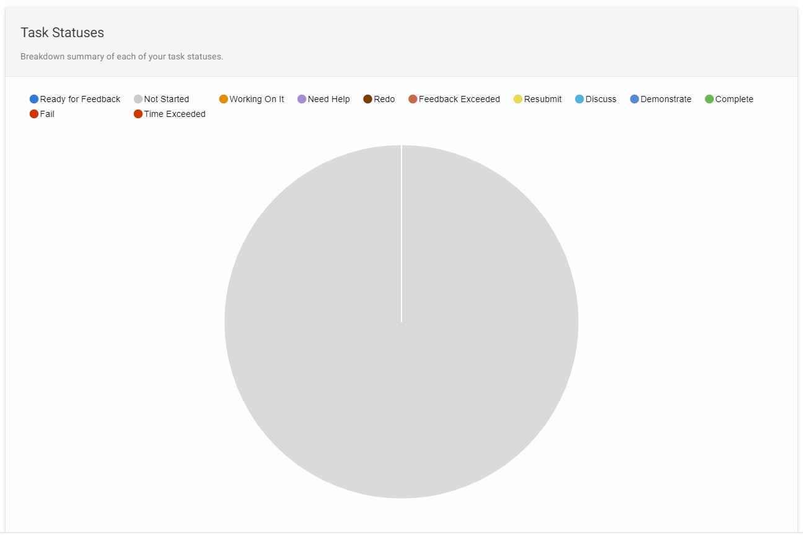
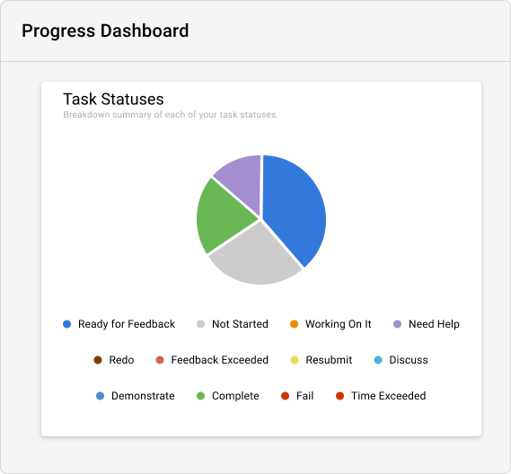

**Student Name: Dylan Sutherland**

**Student ID: 220243462**

**Term: T1 2023 – SIT 374**

**Ontrack Component review check**

First select a component to review from the list below:

[https://deakin365.sharepoint.com/:x:/r/sites/ThothTech2/Shared%20Documents/OnTrack%20-%20UI%20Enhancement/T3\_2022/Management%20%5BT3\_2022%5D/selected\_task(revised).xlsx?d=wac02013da5224c958ac60fd96fac7b20&csf=1&web=1&e=UfCmZ5](https://deakin365.sharepoint.com/:x:/r/sites/ThothTech2/Shared%20Documents/OnTrack%20-%20UI%20Enhancement/T3_2022/Management%20%5BT3_2022%5D/selected_task(revised).xlsx?d=wac02013da5224c958ac60fd96fac7b20&csf=1&web=1&e=UfCmZ5)

**Component Name**

Task Status Pie Chart

- task-status-pie-chart.coffee

**Component purpose**

Displays a summary of current task statuses as a pie chart.

**Component outcomes/interactions**

The expected outcome is a pie chart visualisation that displays the task status summary data in a graphical form. The pie chart will have a slice for each status in the rawData object passed to the component, with each slice colored based on the task status. The chart will display the percentage of the total tasks that each status represents, and optionally show a legend explaining the colors used.The chart will update automatically whenever the rawData object changes, and can be customized by passing in values for the showLegend and height attributes. The tooltip on each slice will display the percentage value of the slice relative to the total number of tasks.

**Component migration plan -** Add your plan for the migration, how will you do this, what steps are needed. Add some sketches or diagrams, what will the migrated component look like compared to the current one.

1. Create new Typescript file task-status-pie-chart.component.ts and define the new component.
2. Refactor the controller with a new TypeScript class that implements the OnInit interface
3. Replace $watch with @Input and @Output
4. Replace the directive with an @Component decorator
5. Refactor the configuration
6. Test the component

`task-status-pie-chart-mockup`

**Component review checklist** – What is needs to be checked for this component to work once migrated?

Once migrated the component should correctly display data in a pie chart format, representing the number of tasks in each status category. The tasks should be coloured in line with the design specifications and a legend should clearly explain what the colours represent. It should be responsive and accessible.

**Discussion with Client (Andrew Cain)**

See if the component is still needed and present this document so Andrew can review if all the outcomes and interactions are correct prior to the migration and build of this component.