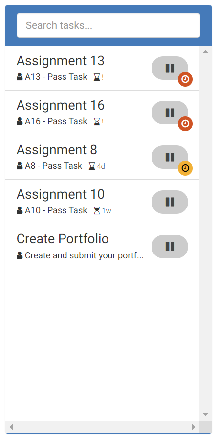

**Student Name: Dylan Sutherland**

**Student ID: 220243462**

**Term: T1 2023 – SIT 374**

**Ontrack Component review check**

First select a component to review from the list below:

[https://deakin365.sharepoint.com/:x:/r/sites/ThothTech2/Shared%20Documents/OnTrack%20-%20UI%20Enhancement/T3\_2022/Management%20%5BT3\_2022%5D/selected\_task(revised).xlsx?d=wac02013da5224c958ac60fd96fac7b20&csf=1&web=1&e=UfCmZ5](https://deakin365.sharepoint.com/:x:/r/sites/ThothTech2/Shared%20Documents/OnTrack%20-%20UI%20Enhancement/T3_2022/Management%20%5BT3_2022%5D/selected_task(revised).xlsx?d=wac02013da5224c958ac60fd96fac7b20&csf=1&web=1&e=UfCmZ5)

**Component Name**

Unit Task List

- unit-task-list.coffee
- unit-task-list.scss
- unit-task-list.tpl.html

**Component purpose**

Displays the task list in the left panel of OnTrack.

It populates the task list based on unit in the current context and filters by grade and also the input search terms and allows a task to be selected.

**Component outcomes/interactions**

The expected outcome is a list of required tasks for the assigned unit which is filtered by the chosen grade. The list should update if a new grade is selected. Above the list there should also be a search bar which allows the tasks to be filtered based on the search input. Each task item should display a task name, an abbreviation, a target grade and status. When a task is selected it should be highlighted in the task list. The component should track the currently selected task.

**Component migration plan -** Add your plan for the migration, how will you do this, what steps are needed. Add some sketches or diagrams, what will the migrated component look like compared to the current one.

1. Create new Typescript file unit-task-list.component.ts and define the new component.
2. Create taskDefinitionName filter
3. Create new html template file and replace the coffee script angularjs code with angular typescript.
4. Update application code to reference new typescript component.
5. Remove old component

**Component review checklist** – What is needs to be checked for this component to work once migrated?

Once migrated the task lists should exhibit the same behaviour as the coffee script component. It should display a filtered list of tasks curated to each user. Each item in the list should include the correct details. All tasks in the list should selectable and communicate this status to other components such as the dashboard.

**Discussion with Client (Andrew Cain)**

See if the component is still needed and present this document so Andrew can review if all the outcomes and interactions are correct prior to the migration and build of this component.
