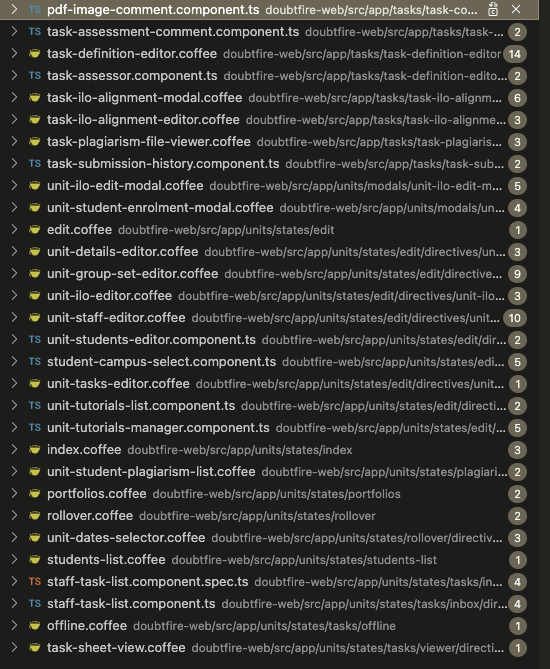
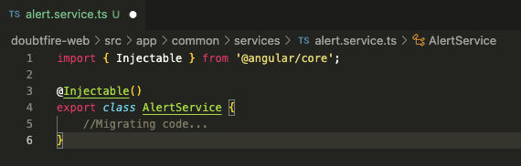

# Ontrack Component review

## Team Member Name

Quoc Vi Cao

Student ID: 221533153

## Component Name

grade-service: doubtfire-web/src/app/common/services/alert-service.coffee

Relevant files:
 -   ``alert-service.component.coffee``
 -   ``alert-service.ts``

## Component purpose

This component gives the alert service of to the components which uses it to pop up alerts for users. For example,
there are request time out alert, exceeded time alert, etc.

## Component outcomes and interactions

There are tons of javascript components that use this alert services. It is also taken by the 'controller'
as the parameter to provide the corresponding alert when the user takes an action. For example, if a user submits a portfolio,
the 'controller' will give 'danger' message when there is error when submitting the file.

In general, all components which are relevant to Tasks or Project are using the 'controller' and this 'controller'
makes use of listener component to return a corresponding action.
## Component migration plan

Migrating the coffee script file into typescript file by creating a class for Listener Serivce.

