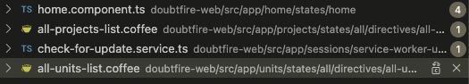
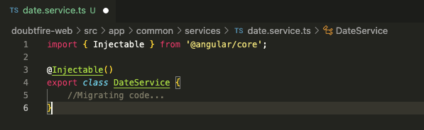

# Ontrack Component review

## Team Member Name

Quoc Vi Cao

Student ID: 221533153

## Component Name

grade-service: doubtfire-web/src/app/common/services/date-service.coffee

Relevant files:
 -   ``date-service.component.coffee``
 -   ``date-service.ts``

## Component purpose

This service provides the date and time for each unit or project.

## Component outcomes and interactions

This service provides the dates to the all-project-list and all-units-list components to indicate the date and time 
that one unit or project is done. The homepage of this component is also use this service to present date and time 
for login timestamp. It is also used by the check-for-update component to keep track of the updates that user makes.

In general, all components which needs to have time stamp are using this service. And this service 
is included in the 'controller' as a parameter.
## Component migration plan

Migrating the coffee script file into typescript file by creating a class for Alert Serivce.

