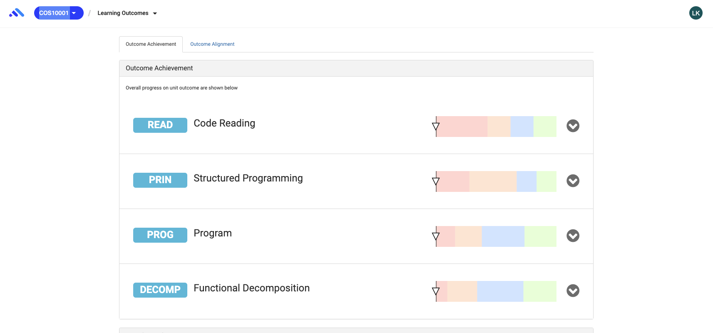
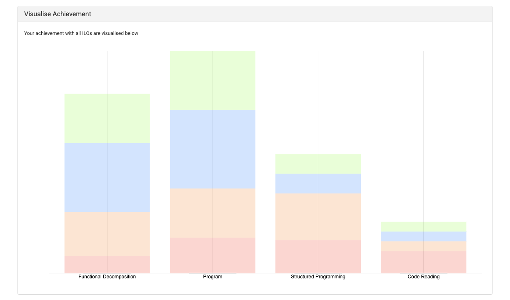
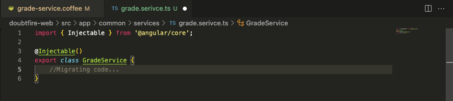

# Ontrack Component review

## Team Member Name

Quoc Vi Cao

## Component Name

grade-service: doubtfire-web/src/app/common/services/grade-service.coffee

Relevant files:
 -   ``grade-service.component.coffee``
 -   ``grade.service.ts``

## Component purpose

This is to provide services that relates to grades and there are 2 components using this service: Outcome Achivement and Visualise Achievement. Examples are shown below:
As a student, he/she can review their learning outcomes:

## Component outcomes and interactions

What are the expected outcomes of the component and what does it interact with, what kind of data

As 
objects is it taking in and passing out?

As this component provides grade service throughout the whole project and it mainly interacts with the learning outcomes (on the header)
The objects of the component is the grades that students can achieve such as Pass, Credit, Distinction, High Distinction which associate with the according colors. 

## Component migration plan

Migrating the coffee script file into typescript file by creating a class for Grades.

