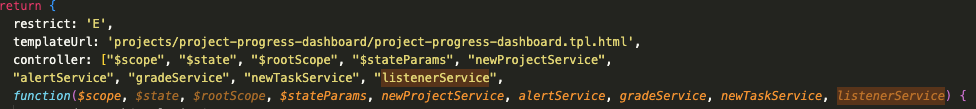
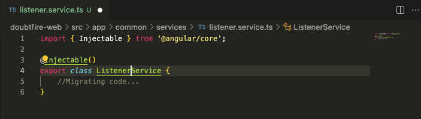

# Ontrack Component review

## Team Member Name

Quoc Vi Cao

Student ID: 221533153

## Component Name

grade-service: doubtfire-web/src/app/common/services/listener-service.coffee

Relevant files:
 -   ``listener-service.component.coffee``
 -   ``listener-service.ts``

## Component purpose

This is to provide services as listeners. When user clicks a block of UI, we pass down the action to the listener service and then based
on the user's choice, it points to the action that needs to be done.

## Component outcomes and interactions

There are tons of javascript components that use the listener services, for example: project-progress-dashboard,
task-dashboard, etc. Mostly, the controller will be using this service to perform the corresponding action.

In general, all components which are relevant to Tasks or Project are using the 'controller' and this 'controller'
makes use of listener component to return a corresponding action.
## Component migration plan

Migrating the coffee script file into typescript file by creating a class for Listener Serivce.

