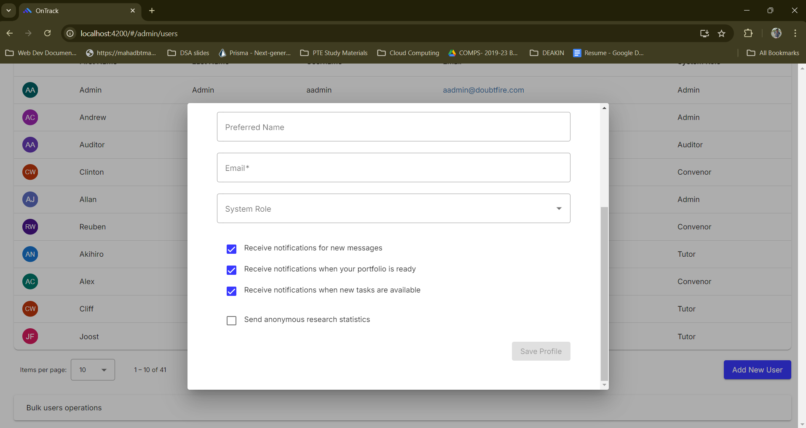
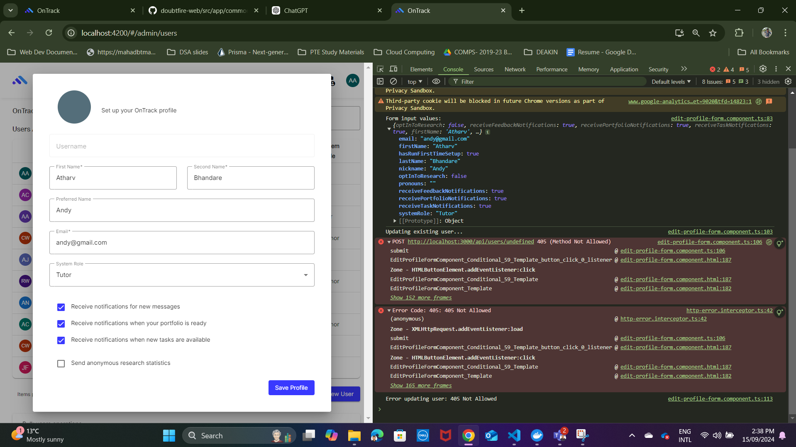
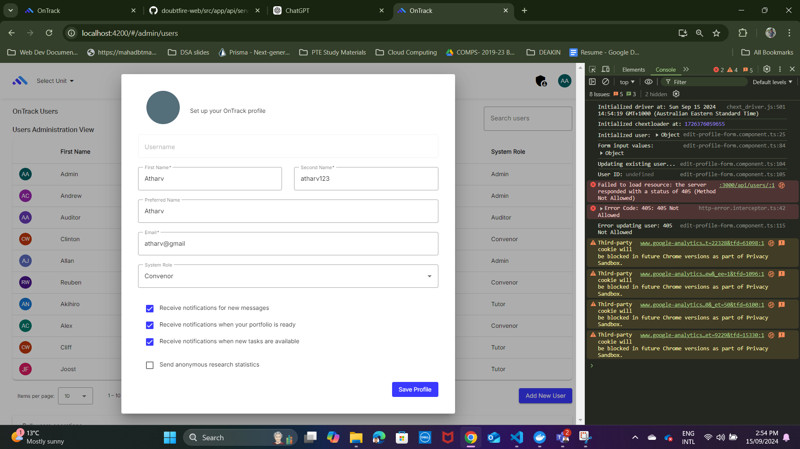

# Debugging Review - Add User UI

## Student Name: Atharv Bhandare

## Student ID: 223650012

## Component Name: edit-profile-form component

## Component purpose

As an admin, I want to be able to "add a new user" to OnTrack. I go to the "Manage User Screen" in User Admin and create users there.

## Description
This documentation is about the debugging process undertaken to resolve a bug in the "Add User UI" component.
The primary purpose of this component is to allow an admin to add a new user to the OnTrack platform or edit the profile of an existing user. But the issue is the "Add User" UI did not allow the creation or update of users.

## Component outcomes and interactions

The expected outcome of this component is that when a user (admin) clicks "Save Profile," a new user is added to the system or an existing user's details are updated.

## Issue Summary
The issue was that the "Add User" UI did not allow the creation or update of users, leading to a **405 Method Not Allowed** error.

## Component Debugging plan

- **Initial Investigation**:
  - Observed that the `submit()` method in "edit-profile-form.component.ts" was triggered when clicking "Save Profile," responsible for sending `POST` (create) or `PUT` (update) requests.

- **Troubleshooting Approach**:
  - Added `console.log()` statements to inspect form inputs and confirmed the data was being passed correctly.

- **Backend Issue**:
  - Encountered a **405 Method Not Allowed** error during the user creation/update process, indicating potential backend handling issues.

- **User ID Missing**:
  - Found that the `user.id` was `undefined` during the update process, which led to request failures. Verified the issue by logging the `id`.

- **UI Improvement**:
  - Added a scrollable feature to ensure the "Save Profile" button remained visible in the form when the content was long.