# Create Brance and Initial Migration

> Trimester 3 2022

**IMPORTANT!!! Make sure you already deploy OnTrack locally following
[Docker Setup Tutorial](../Deploy%20OnTrack%20using%20Docker/Docker_Setup_Tutorial.md).**

---

## Create Branch in your Repo

---

```console
git checkout development # make sure you are on develop
git pull --rebase upstream development # sync your local develop with upstream's develop
```

```console
git fetch origin
```

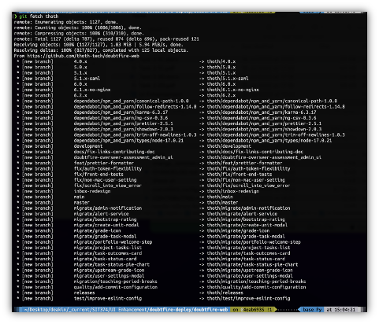

```console
cd doubtfire-web
git checkout -b migrate/not-found
```

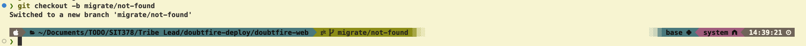

When click into the branch, you should see the newly created branch.

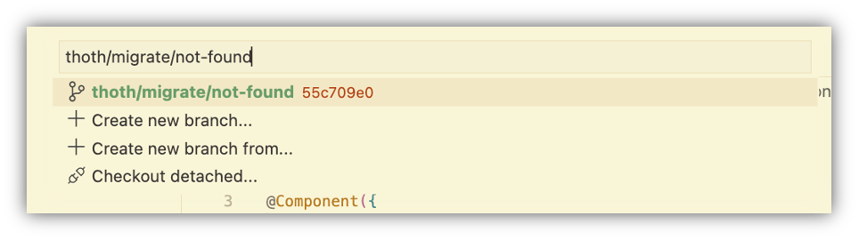
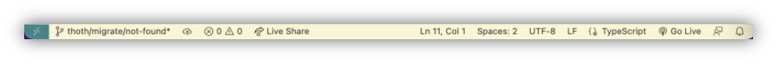

```console
git remote -v
```

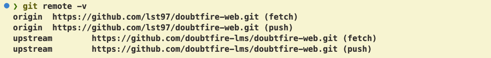

## Initial Migration

---

### **1. Create a typescript, scss (if exists), and html file**

For the Task Description Card we had the files:

- not-found.coffee
- not-found.tpl.html
- not-found.scss

**In the same folder we can start by creating the following files:**

- not-found.component.ts
- not-found.component.html
- not-found.component.scss

Notice the naming convention. When migrating a component we use the format name.component.extension.
Add the start of the TypeScript using something based on the following:

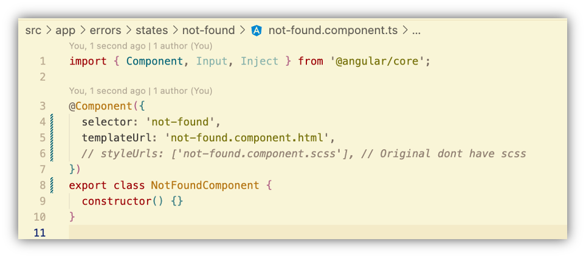

We can’t see any of these changes yet, but it is a good clean start so let’s commit this before we
move on.

```console
git add .
git commit -m "build: create initial files for migration”
git push --set-upstream origin touth/migrate/not-found
```

Then we should make sure to push this back to GitHub so others can see our progress. As this is a
new branch you will need to set the upstram branch, but if you forget the `git push` will remind you
anyway.

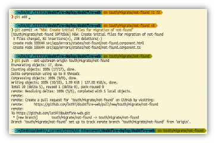

Run checkout to see the change.

```console
git checkout
```

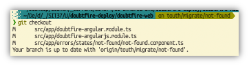

### **2. Linking New and Unlink Old Module**

In the ./src/app you should see

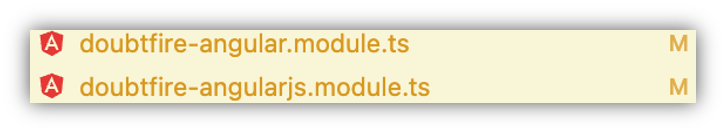

Because we want to migrate AngularJS to Angular, therefore we need to unlink the module from
AngularJS and link to Angular.

1. Delete the import from related module from (doubtfire-web/src/app.doubtfire-angularjs.module.ts)
   - 
2. Import the newly created TypeScript component
   - 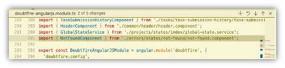
3. Downgrade the TypeScript Component from (doubtfire-web/src/app.doubtfire-angularjs.module.ts)
   - 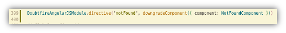
4. Import the new Component to Angular
   - 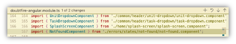
5. Add to the Ng Module
   - 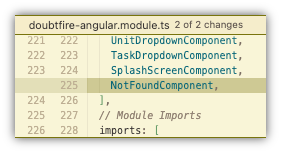
6. Delete module injection if neccessary (parent_folder_name/parent_folder_name.coffee)
   - 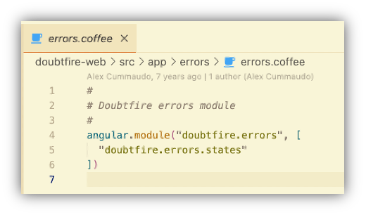

---

## **Congratulations**

It is **DONE** for the initial migration. At this stage, you will need to upskill yourself about
TypeScript, Angular and AngularJS and working in the code base and read the document about Regular
Migration. Good Luck!
