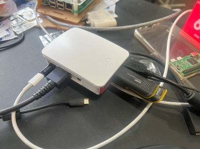
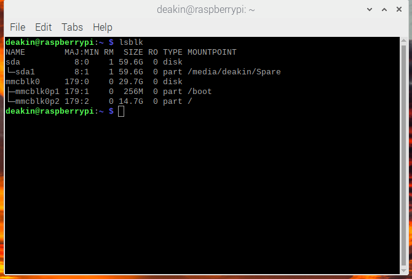

## Intorduction

This document will outline how to create a compressed disk image of the Rasberry Pi that can then be
burnt to new SD cards using the [Raspberry Pi imager](https://www.raspberrypi.com/software/) or a
program like [etcher](https://etcher.balena.io/). Using this process, you can make new Gold Images
and backups of the running software for the Arcade Machines. This process uses a script called
PiShirnk https://github.com/Drewsif/PiShrink

The process was derived from this article:
https://www.tomshardware.com/how-to/back-up-raspberry-pi-as-disk-image

### Current Compressed Gold Image

https://deakin365.sharepoint.com/:u:/r/sites/ThothTech2/Shared%20Documents/SplashKit/Arcade%20Machine%20Image/ArcadeImage-19.08.2023.img.gz?csf=1&web=1&e=SdRhVX

The current Compressed Gold Image is on the Thoth Tech Teams SharePoint Site. This is persistent but
only accessible to Thoth Tech team members.

## Requirements

- USB Key larger capacity than current SD Card in Pi
- Raspberry Pi with Arcade image

Note it is possible to change the partition sizes on the Pi to use a smaller USB key, but I have not
tested that process, and it is beyond the scope of this document. If you need that process, please
refer to the Toms Hardware article above, and if successful, please update this document with the
additional optional process.

## Create Disk Image

1. Format USB key
   - Format the USB Key as either NTFS (if using Windows) or EXT4 (if using Linux); I'm not sure
     what is best for Mac OS. (This Wiki How Article explains how to format a key on Windows
     https://www.wikihow.com/Format-a-Flash-Drive)
1. Connect the USB key to the Pi

   

1. On the Pi, open a terminal and run the following to install pishrink.sh and move it to
   /usr/local/bin
   ```
   wget https://raw.githubusercontent.com/Drewsif/PiShrink/master/pishrink.sh
   sudo chmod +x pishrink.sh
   sudo mv pishrink.sh /usr/local/bin
   ```
1. Check the mount point of the USB Key with this command

   ```
   lsblk
   ```

   

   You should be able to see the mount point for the USB ours has been mounted at
   `/media/deakin/Spare` (Spare is the volume name set during formatting)

1. Copy the current SD card to the USB as an image file, i.e. my command was
   `sudo dd if=/dev/mmcblk0 of=/media/deakin/Spare/ArcadeImage-19.08.2023.img bs=1M` Set the
   filename as you see fit but if updating the gold image suggest using a date or version number.
   ```
   sudo dd if=/dev/mmcblk0 of=[mount point]/myimg.img bs=1M
   ```
1. Move to the USB root directory, i.e. my command `cd /media/deakin/Spare`
   ```
   cd cd /media/pi/[volume]
   ```
1. Run pishrink with -z option; this will zip the image with gzip.
   ```
   sudo pishrink.sh -z ArcadeImage-19.08.2023.img
   ```

You should now have a compressed image file, i.e. `ArcadeImage-19.08.2023.img.gz` refer to
[Setup Arcade Machine.md](Setup%20Arcade%20Machine.md) for instructions on burning the image to a
new SD card or USB.
