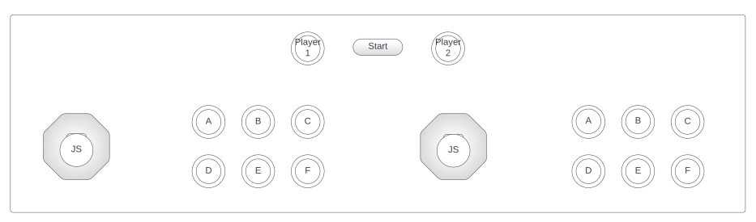

# Arcade Machine Controls

Table of content

- [About Controls](#about-controls)
- [User Story](#user-story)
- [Use Case Diagram](#use-case-diagram)
- [Sequence Diagram](#sequence-diagram)

## About Controls

Two `joysticks` and `buttons` are controls found on the deck of the arcade machine. Specifically, there are nine (9) `buttons` on the deck. Six of these are positioned on the right side of each of the `joysticks` (**JS**), marked with letters A to F. Lastly, the `start` button at the top-centre of the deck with the `player 1` and `player 2` buttons at the left and right-hand side of it. See the UI mockup below.

## User Story

| Label | Details |
| --- | --- |
| Description | Players use a joystick and buttons in the deck of the arcade machine to start, control, pause and end actions of the objects on the arcade machine’s screen. |
| User story | As a player, I want to use game controls to play games on the Deakin School of IT's arcade machine. |
| Acceptance criteria | - a player should not be able to interact with (or play) a game without pressing the `start` button (or inserting a coin). - These controls must be the only user interface a player has with the game in the arcade machine. - Code testing is required. |
| Data validation | 1. Ensure that the arcade machine is connected to the power and switched on.  2. Ensure that games are loaded on the machine.  3. Confirm whether a `start` button has been engaged (or a coin has been inserted). |
| API/Code | ..to be added/linked |

## Use Case Diagram

## Sequence Diagram

