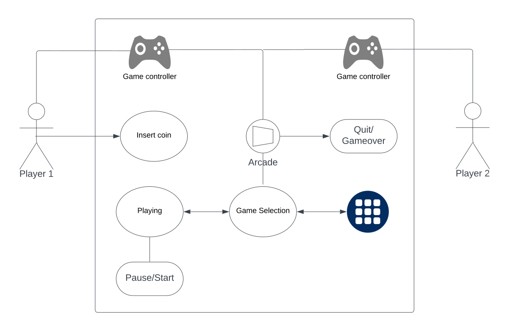
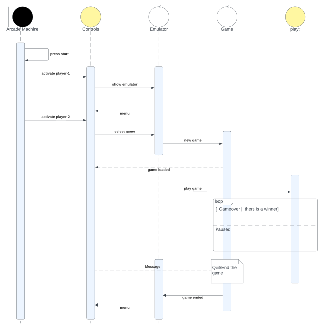

# Arcade Machine Controls

Table of content

## About Controls

Two joysticks and buttons are controls found on the deck of the arcade machine. Specifically, there are nine (9) buttons on the deck. Six of these are positioned on the right side of each of the joysticks (JS), marked with letters A to F. Lastly, the ‘start’ button at the top-centre of the deck with the ‘player 1’ and ‘player 2’ buttons at the left and right-hand side of it.

## User Story

| Label | Details |
| --- | --- |
| Description | Players use a joystick and buttons in the deck of the arcade machine to start, control, pause and end actions of the objects on the game’s screen. |
| User story | As a player, I want to use game controls to play games on the Deakin School of IT's arcade machine. |
| Acceptance criteria | a |
| Data validation | a |
| API/Code | ..to be added/linked |

## Use Case Diagram

## Sequence Diagram

