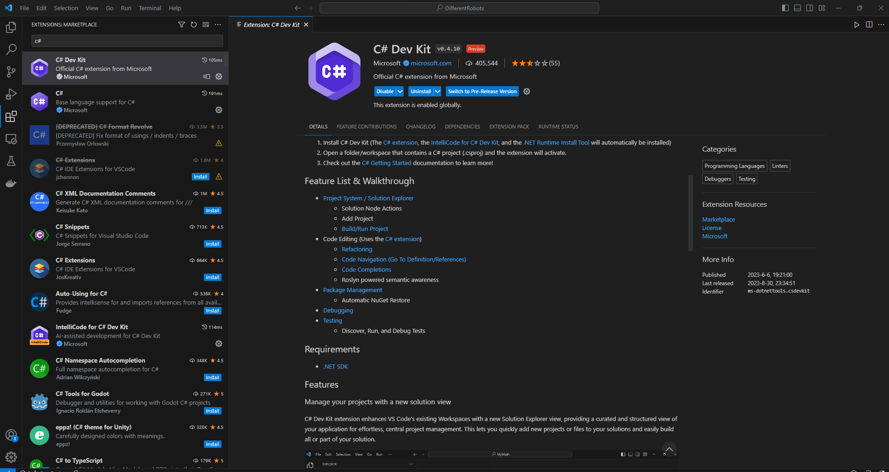
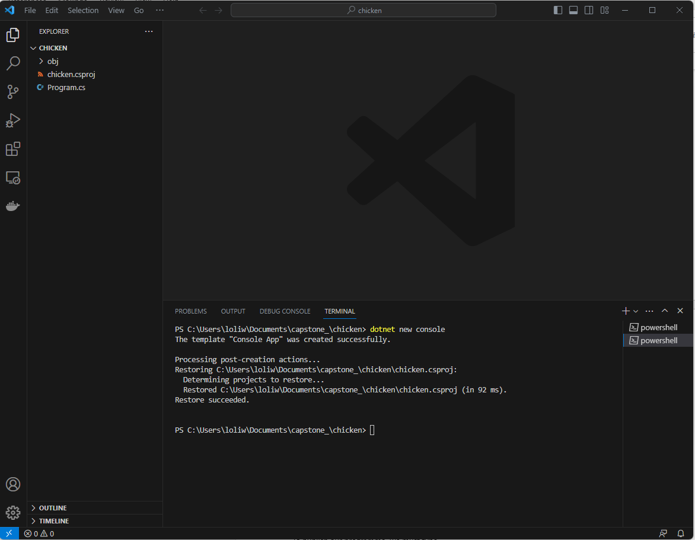
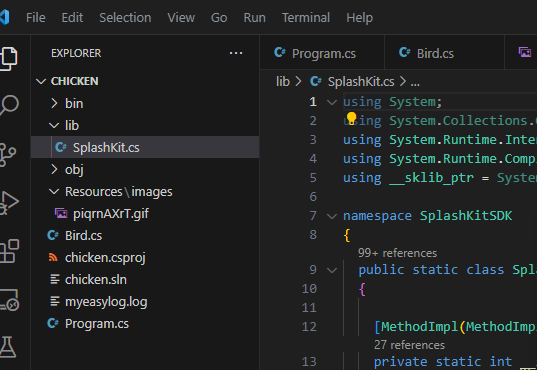

# Guide on adding C# packaging to Game Packaging

1. Open the Command Prompt or terminal and type the following.

    ```cpp
    dotnet --version
    ```

2. Press `enter` to check whether you have `.NET SDK` installed. If not, download/install the latest version of `.NET SDK`.

3. Open `Visual Studio Code` After installing or confirming the above. Search and install the `C# extension` on `Visual Studio Code`.

    

4. Create or open your c# project. Note, if you are using an existing code, you may need to update or reinstall old versions of `.NET core`, and don't forget to update/load the `SplashKit` library on your project.

    
    

5. For illustration, we will use the following c# code, which goes to two `.cs` files:

    ```cpp
    using System;
    using SplashKitSDK;

    public class Program
    {
        public static void Main()
        {
            Window gameWindow;
            gameWindow = new Window("SkyBlue", 800, 600);

            Bird st = new Bird(gameWindow);
            
            while (!st.Quit & !gameWindow.CloseRequested)
            {
                SplashKit.ProcessEvents();
                gameWindow.Clear(Color.White);
                st.Draw();
                gameWindow.Refresh(60);

                st.HandleInput();
                st.StayOnWindow(gameWindow);
            }
        }
    }
    ```

    ```cpp
    using System;
    using SplashKitSDK;

    public class Bird
    {
        private Bitmap _BirdBitmap;
        const int gravity = 10;
        const int SPEED = 5;

        public double X { get; private set; }
        public double Y { get; private set; }
        public bool Quit { get; private set; }

        public int Width
        {
            get
            {
                return _BirdBitmap.Width;
            }
        }

        public int Height
        {
            get
            {
                return _BirdBitmap.Height;
            }
        }


        public Bird(Window gameWindow)
        {    
            _BirdBitmap = new Bitmap("Bird", "piqrnAXrT.gif");
            X = (gameWindow.Width - Width)/2;
            Y = (gameWindow.Height - Height)/2;        
            Quit = false;

        }

        public void Draw()
        {
            SplashKit.ProcessEvents();
            SplashKit.DrawBitmap(_BirdBitmap, X, Y);
        }

        public void HandleInput()
        {

            if (SplashKit.KeyDown(KeyCode.LeftKey))
            {
                X = X - SPEED;
            }
            if (SplashKit.KeyDown(KeyCode.RightKey))
            {
                X = X + SPEED;
            }

            if (SplashKit.KeyDown(KeyCode.DownKey))
            {
                Y = Y + gravity;
            }
            if (SplashKit.KeyDown(KeyCode.UpKey))
            {
                Y = Y - gravity;
            }
            
            if (SplashKit.KeyDown(KeyCode.EscapeKey))
            {
                Quit = true;
            }
        }

        public void StayOnWindow(Window gameWindow)
        {
            const int GAP = 10;

            if (X < GAP)
            {
                X = GAP;
            }
            else if (X > gameWindow.Width - GAP - Width)
            {
                X = gameWindow.Width - GAP - Width;
            }
            if (Y < GAP)
            {
                Y = GAP;
            }
            else if (Y > gameWindow.Height - GAP - Height)
            {
                Y = gameWindow.Height - GAP - Height;
            }
        }
    } 
    ```

6. On the terminal, type the following commands and press **enter** after each to `build`, `run`, `package` and `publish` your c# code.

    ```cpp
    dotnet build
    ```

    ```cpp
    dotnet run
    ```

    You will need to update the metadata for the discoverability of your package, before the following commands.
    

    ```cpp
    dotnet pack .....
    ```

    You can publish/deploy your package in several areas, such as NuGet.org, GitHub (or GitHub workflow), Azure, etc. Importantly, all external locations require you to sign in and click, drag, search, commit, copy, and paste for your package to be loaded/saved in your targeted location. Else through a command line:

    ```cpp
    dotnet publish -o <directory/path> --configuration Release -r win-X64 --no-self-contained --version-suffix <version-number>
    ```
