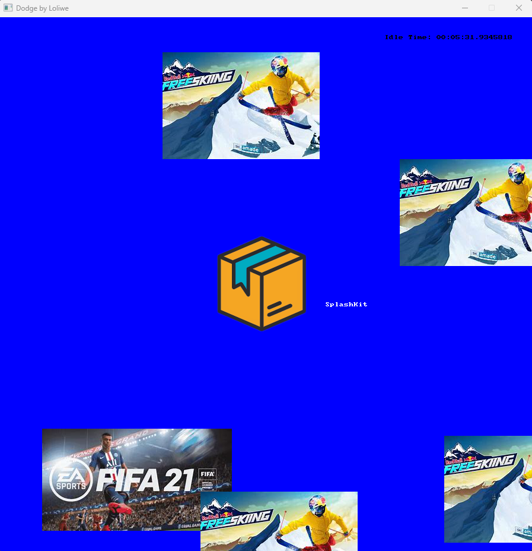

# Emulation graphics

As a player, I wish to have a SplashKit graphic screen as part of the Emulation Station or for one of our games. So we would have the following `Main` method that will need to be executed.

```cpp
using System;
using SplashKitSDK;

namespace cgrap
{
    public class Program
    {
        public static void Main()
        {
            Window gameWindow;
            gameWindow = new Window("Dodge by Loliwe", 900, 900);

            RunningGraphics st = new RunningGraphics(gameWindow);

            while (!gameWindow.CloseRequested)
            {
                SplashKit.ProcessEvents();
                st.Draw();
                st.Update();
                gameWindow.Refresh(60);
            }
        }
    }
}
```

The next two codes are for graphics that will be displayed when our game has been selected.

```cpp
using System;
using System.Collections.Generic;
using System.ComponentModel;
using System.Data;
using System.Drawing;
using System.Linq;
using System.Text;
using System.Threading.Tasks;
using SplashKitSDK;

namespace cgrap
{
    public abstract class Graphics
    {
        public int time;
        public double X { get; private set; }
        public double Y { get; private set; }
        private Vector2D Velocity { get; set; }
        public Bitmap pic1, pic2, pic3, pic4;

        public int Width
        {
            get { return 50; }
        }

        public int Height
        {
            get { return 50; }
        }

        public Circle CollisionCircle
        {
            get {return SplashKit.CircleAt(X + 0.1 * Width, Y + 0.1 * Height, 20); }
        }

        public Graphics(Window gameWindow, Logo logo){ //constructor

        pic1 = SplashKit.LoadBitmap("Fifa", "fifa.jpg");
        pic2 = SplashKit.LoadBitmap("Gameboy", "imgv.jpg");
        pic3 = new Bitmap("Mario", "mario.jpg");
        pic4 = new Bitmap("Ski", "ski.jpg");

        if (SplashKit.Rnd() < 0.5)
        {
            //We picked ...Top/Bottom
            X = SplashKit.Rnd(gameWindow.Width);

            if (SplashKit.Rnd() < 0.5)
                Y = -Height;
            else
                Y = gameWindow.Height;
        }
        else
        {
            //We picked ...Left/Right
            Y = SplashKit.Rnd(gameWindow.Height);

            if (SplashKit.Rnd() < 0.5)
                X = -Width;
            else
                X = gameWindow.Width;
        }

        const int SPEED = 1;

        Point2D fromPt = new Point2D()
        {
            X = X, Y = Y
        };

        Point2D toPt = new Point2D()
        {
            X = logo.X, Y = logo.Y
        };

        //the direction to head
        Vector2D dir;
        dir = SplashKit.UnitVector(SplashKit.VectorPointToPoint(fromPt, toPt));

        //Setting the speed and assigning it to the Velocity
        Velocity = SplashKit.VectorMultiply(dir, SPEED);
        }

        public abstract void Draw();

        public void Update()
        {
            X = X + Velocity.X;
            Y = Y + Velocity.Y;
        }

        public bool IsOffscreen(Window screen)
        {
            return (X < 0 || X > screen.Width || Y < 0 || Y > screen.Height);
        }

       public bool IsOffTime(int a)
        {
            if(a - time >= 2)
            {
                return true;
            } else {
                return false;
            }
        }
    }

    public class Pdr : Graphics
    {
        public Pdr(Window gameWindow, Logo logo) : base(gameWindow, logo)
        {

        }

        public override void Draw()
        {
            SplashKit.DrawBitmap(pic1, X, Y);
        }
    }

    public class Row : Graphics
    {
        public Row(Window gameWindow, Logo logo) : base(gameWindow, logo)
        {

        }

        public override void Draw()
        {
            SplashKit.DrawBitmap(pic2, X, Y);
        }
    }

    public class Gas : Graphics
    {
        public Gas(Window gameWindow, Logo logo) : base(gameWindow, logo)
        {

        }

        public override void Draw()
        {
            //SplashKit.DrawBitmap(pic3, X, Y);
            pic3.Draw(X, Y);
        }
    }

    public class Last : Graphics
    {
        public Last(Window gameWindow, Logo logo) : base(gameWindow, logo)
        {

        }

        public override void Draw()
        {
            //SplashKit.DrawBitmap(pic4, X, Y);
            pic4.Draw(X, Y);
        }
    }
}
```

```cpp
using System;
using cgrap;
using SplashKitSDK;

public class Logo
{
    private Bitmap pic5;

    public double X { get; private set; }
    public double Y { get; private set; }

    public Logo(Window gameWindow)
    {    
        pic5 = SplashKit.LoadBitmap("Sc253", "253.png");
    }

    public void Draw()
    {
        SplashKit.DrawBitmap(pic5, 290, 300);
    }

    public bool CollideWith(Graphics graphics)
    {
        return pic5.CircleCollision(X, Y, graphics.CollisionCircle);
    }
}
```

The next code is adding the timer.

```cpp
using System;
using SplashKitSDK;

namespace cgrap
{
    public class Time
    {
        public int current_time;
        public SplashKitSDK.Timer myTimer;
        private DateTime _start;

        public Time()
        {
            myTimer = new SplashKitSDK.Timer("My Timer");
            _start = DateTime.UtcNow;
            myTimer.Start();
        }

        public void Draw(Window gameWindow)
        {
            gameWindow.DrawText($"Idle Time: {(DateTime.UtcNow - _start)}", Color.Black, "Arial", 20, gameWindow.Width-250,30);
        }
    }
}
```

The code the brings everything together is the following. Meaning it links the Program class (i.e., the first code above) with Graphics, Timer and Logo classes.

```cpp
using System;
using System.Collections.Generic;
using cgrap;
using SplashKitSDK;

public class RunningGraphics
{
    private Logo _Logo;
    private Window _GameWindow;
    private Time MyTimer;

    private List<Graphics> _robots = new List<Graphics>();
    private List<Graphics> _checkOffrobots = new List<Graphics>();

    public RunningGraphics(Window gameWindow)
    {
        _GameWindow = gameWindow;
        _Logo = new Logo(_GameWindow);
        MyTimer = new Time();
    }

    public void Draw()
    {
        _GameWindow.Clear(Color.Blue);
        _Logo.Draw();
        MyTimer.Draw(_GameWindow);

        foreach (Graphics graphics in _robots)
        {
            graphics.Draw();
        }
        _GameWindow.DrawText("SplashKit", Color.White, "Arial", 30,550,480);
        _GameWindow.Refresh(60);
    }

    public void Update()
    {
        double manyR = SplashKit.Rnd();
        if (manyR < 0.01)
        {
            _robots.Add(RandomRobot());
        }

        CheckCollisions();

        foreach (Graphics graphics in _robots)
        {
            graphics.Update();
        }
    }

    public Graphics RandomRobot()
    {
        Graphics robot = new Pdr(_GameWindow, _Logo);
        Graphics robot2 = new Row(_GameWindow, _Logo);
        Graphics robot3 = new Gas(_GameWindow, _Logo);
        Graphics robot4 = new Last(_GameWindow, _Logo);

        double manyR = SplashKit.Rnd(4);
        if (manyR < 1)
        {
            robot.time = MyTimer.current_time;
            return robot;
        }
        else if (manyR > 1 && manyR < 2)
        {
            robot2.time = MyTimer.current_time;
            return robot2;
        }
        else if (manyR > 2 && manyR < 3)
        {
            robot3.time = MyTimer.current_time;
            return robot3;
        } 
        else
        {
            robot4.time = MyTimer.current_time;
            return robot4;
        } 
    }

    private void CheckCollisions()
    {
        foreach(Graphics graphics in _robots)
        {
            if (graphics.IsOffscreen(_GameWindow))
            {
                _checkOffrobots.Add(graphics);
            }
        }
        
        foreach(Graphics graphics in _checkOffrobots)
        {
            _robots.Remove(graphics);
        }
    }
}
```

A screenshot of our graphics is below.

