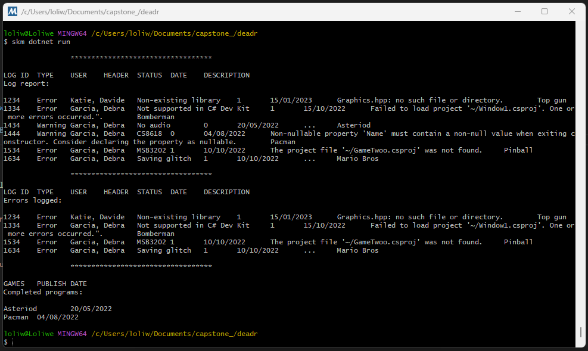

# Code for separating games

The code below separates completed games from those in the development stage in line with their labelling. **Note** that the `XML` file used in the code is not attached, but that file's data can be viewed in the image below.

```cpp
using System;
using System.Collections.Generic;
using System.Linq;
using System.Xml.Linq;
using Microsoft.VisualBasic;
using SplashKitSDK;

namespace deadr
{
    public class Program
    {
        private static List<Log> Books = new List<Log>();
        public static void Main(string[] args)
        {
            FillList();

            // Find all logged errors.
            List<Log> results = Books.FindAll(FindError);
            if (results.Count != 0)
            {
                DisplayResults(results, "Errors logged: ");
            }
            else
            {
                Console.WriteLine("\nNo results found.");
            }

            // Find all completed games.
            results = Books.FindAll(
            delegate(Log bk)
            {
                return bk.Status < 1.00;
            }
            );
            if (results.Count != 0)
            {
                DisplayCompleted(results, "Completed programs:");
            }
            else
            {
                Console.WriteLine("\nNo completed program found.");
            }
        }

        // Populates the list with sample data.
        private static void FillList()
        {

            // Create XML elements from a source file.
            XElement xTree = XElement.Load(@"~/books.xml");

            // Create an enumerable collection of the elements.
            IEnumerable<XElement> elements = xTree.Elements();

            // Evaluate each element and set set values in the book object.
            foreach (XElement el in elements)
            {
                Log book = new Log();
                book.ID = el.Attribute("id").Value;
                IEnumerable<XElement> props = el.Elements();
                foreach (XElement p in props)
                {

                    if (p.Name.ToString().ToLower() == "user")
                    {
                        book.User = p.Value;
                    }
                    else if (p.Name.ToString().ToLower() == "title")
                    {
                        book.Title = p.Value;
                    }
                    else if (p.Name.ToString().ToLower() == "genre")
                    {
                        book.Genre = p.Value;
                    }
                    else if (p.Name.ToString().ToLower() == "status")
                    {
                        book.Status = Convert.ToDouble(p.Value);
                    }
                    else if (p.Name.ToString().ToLower() == "publishdate")
                    {
                        book.Publish_date = Convert.ToDateTime(p.Value);
                    }
                    else if (p.Name.ToString().ToLower() == "description")
                    {
                        book.Description = p.Value;
                    }
                    else if (p.Name.ToString().ToLower() == "name")
                    {
                        book.Name = p.Value;
                    }
                }

                Books.Add(book);
            }

            DisplayResults(Books, "Log report:");
        }

        // Explicit predicate delegate.
        private static bool FindError(Log bk)
        {

            if (bk.Genre == "Error")
            {
                return true;
            }
        else
            {
                return false;
            }
        }

        private static void DisplayResults(List<Log> results, string title)
        {
            Console.WriteLine();
            Console.WriteLine("                **********************************");
            Console.WriteLine("\n{0}\t{1}\t{2}\t{3}\t{4}\t{5}\t{6}", "LOG ID", "TYPE", "USER", "HEADER", "STATUS", "DATE", "DESCRIPTION");
            Console.WriteLine(title);
            foreach (Log b in results)
            {

                Console.Write("\n{0}\t{1}\t{2}\t{3}\t{4}\t{5}\t{6}\t{7}", b.ID, b.Genre,
                    b.User, b.Title, b.Status, b.Publish_date.ToShortDateString(), b.Description, b.Name);
            }
            Console.WriteLine();
        }

         private static void DisplayCompleted(List<Log> results, string title)
        {
            Console.WriteLine();
            Console.WriteLine("                **********************************");
            Console.WriteLine("\n{0}\t{1}", "GAMES", "PUBLISH DATE");
            Console.WriteLine(title);
            foreach (Log b in results)
            {

                Console.Write("\n{0}\t{1}", 
                    b.Name, b.Publish_date.ToShortDateString());
            }
            Console.WriteLine();
        }
    }

    public class Log
    {
        public string ID { get; set; }
        public string User { get; set; }
        public string Title { get; set; }
        public string Genre { get; set; }
        public double Status { get; set; }
        public DateTime Publish_date { get; set; }
        public string Description { get; set; }
        public string Name { get; set; }
    }
}
```

The above code produces the following output:

