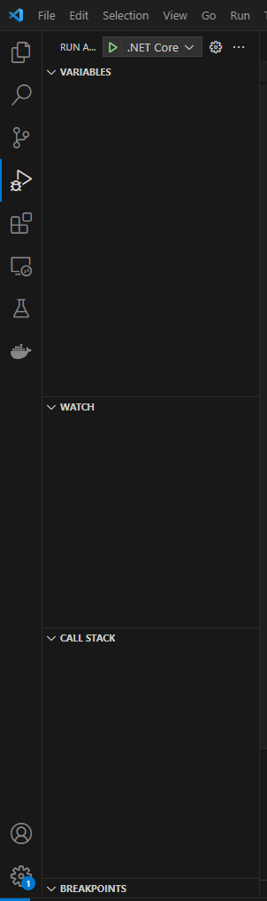

# Introduction

When your arcade machine controls (i.e., joysticks or buttons) are not working at all or some are
not working properly. You can debug and repair them by trying the following.

## Physical challenges

1. Open the machine and check its `wiring`. Wires are connected to the joysticks and buttons on the
   one end. If some controls are broken or loose, they will stop working. These wires may need to be
   replaced or reconnected.
2. Open the machine and check the `stabilizers` for the controls, whether they are to keep them from
   wobbling or getting stuck during use. The `stabilizers` may need to be replaced or supported.
3. Move the `joystick` in different directions and press different `buttons` to detect stiffness,
   worn-out, or damaged controls. These controls may need to be replaced.
4. Check the machine's `ground wiring` (or `circuit`) to see whether it is properly connected. This
   is a switch that provides life to the controls. The ground wiring (or circuit) may need to be
   appropriately connected using the wires.

## Coding challenges

1. Open the project you want to debug on Visual Studio Code. Click the `Run and Debug` icon on the
   left side or press `Ctrl + Shift + D`. Next, click on the `green arrow` button that will appear
   at the top of your code for debugging the code. Pay attention to (or use) the split screen on the
   left with the 'variables', 'watch', and 'call stack' sections. Also, you can use line
   _breakpoints_, _conditional breakpoints_ and _logpoints_. These are important to assist in
   tracking sections where you suspect there might be errors in your code. 

2. The next option is to write a code that tests/scans bugs in your controls. See the code below.

```cpp
using System;
using System.Data;
using System.Diagnostics;
using System.Diagnostics.Conditional;

public class ControlsDebug
{
    private string key;

    public ControlsDebug(string key)
    {
        _key = key;
    }

    public void Test(string key)
    {

        if (SplashKit.KeyDown(KeyCode Key))
        {
            try
            {
                Console.WriteLine($"{key} was engaged and it is working perfectly");
            }
            catch(Exception e)
            {
                Debug.Fail("Invalid action: " + _controls_json.ReadString(key), $"{key} is not working");
                Console.WriteLine(e.Message);
            }
        }
    }
}
```
