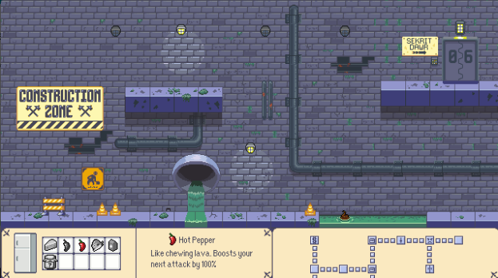

# Thoth Tech

## Application Team | Build An Exception Game

## Table of Contents

[Name of Game](#name-of-game)

[Genre](#genre)

[Art Style](#art-style)

[How the Game Works](#how-the-game-works)

[How the Game is Played with Duos](#how-the-game-is-played-with-duos)

[How the Game is Played Solo](#how-the-game-is-played-with-solo)

[How the Game is Won](#how-the-game-is-won)

[Level Plan](#level-plan)

[How the Game is Lost](#how-the-game-is-lost)

[Lore](#lore)

[The Mission](#the-mission)

[The Enemies](#the-enemies)

[The Water Company](#the-water-company)

[Your Tools](#your-tools)

[Did You Know? (Loading Screen Messages)](#did-you-know-loading-screen-messages)

[Reference Art / Early Sketches](#reference-art--early-sketches)

[Sewer Reference Art](#sewer-reference-art)

[Water Reference Art](#water-reference-art)

[Pipes Early Sketch](#pipes-early-sketch)

[Created Assets](#created-assets)

[Appendices](#appendices)

[Defining the Game: The Victory and Loss Conditions](#defining-the-game-the-victory-and-loss-conditions)

[Active Challenges of the Game](#active-challenges-of-the-game)

[Internal Economy of the Game](#internal-economy-of-the-game)

[Describing the Rules of the Game](#describing-the-rules-of-the-game)

[Operational Rules (Intrinsic Relationship with Constitutive Rules)](#operational-rules-intrinsic-relationship-with-constitutive-rules)

[Constitutive Rules (Intrinsic Relationship with Operational)](#constitutive-rules-intrinsic-relationship-with-operational)

[Implicit Rules](#implicit-rules)

[Description of Game Mechanics using Rules](#description-of-game-mechanics-using-rules)

[Goals](#goals)

[Psychological Techniques](#psychological-techniques)

[Key Terminologies](#key-terminologies)

## Name of Game

Below the Surface\_

## Genre

Collaborative Puzzle Platformer\_

## Art Style

Pixel Art\_

## How the Game Works

The game works by traversing the level and solving complex puzzles with pipes and valves to advance
to the next level. However, there are enemies roaming around the level that will try and kill you,
there will be two types of enemies, one being your usual enemy, and the other a boss, which you will
need to kill if you’re to progress further in the game, you can avoid the enemies if you can, but
you have to defeat the bosses. Additionally, there might be toxic chemicals throughout the levels
that you’ll need to clear by completing the level, and there might be areas within the level that
are blocked by water in which you need to fix by placing a pipe on it or turning a valve.

## How the Game is Played with Duos

This game is mainly played by two people. One player will be pink, and the other will be blue. Their
colours are important as there will be interactable pipes around each level that will be
interactable to their specific player. If player pink attempts to interact with a blue pipe, they
cannot do so, it must be player blue that needs to interact with it. This should allow collaboration
between the two as they can’t advance if they don’t work together as a team.

## How the Game is Played with Solo

If the game is played solo. Then the colour of the player will be purple (mix of pink and blue). And
because it is purple, all the interactable pipes will also be purple. However, some levels may need
to remove or changed due to some levels requiring a duo to advance, but it should still challenge
the player overall.

## How the Game is Won

The game is won by defeating all the bosses in the game without running out of lives. You start with
3 lives.

### The Player's Movement and Abilities Include

- Walking
- Jumping
- Crouching
- Wrench Attack
- Falling Down
- Victory Dance
- Pick Up Pipe

## Level Plan

**Level 1**: Each player must complete their own tasks to get to the door. **Level 2**: Work as a
team to solve the puzzle (purple/solo player skips this level). **Level 3**: Puzzle is harder.
**Level 4**: Enemies start spawning on the right side of the screen. **Level 5**: Enemies are all
around the level avoid them and get to the boss checkpoint. **BOSS FIGHT!** (can only try 3 times or
however many lives collected from the checkpoint,  if YOU LOSE: start again/play again? YES: restart
**NO: Roll credits  IF WON**: proceed to explore the bunker.  **Level 6**: blob monsters are
introduced  (a short convo between players):  _"What is that?!"_

\_"Looks like matters are worse than we thought, there is a barrel of toxic waste knocked over and
contaminating the water!”

\_“No wonder those rats were so big! But I was talking about that weird blob thing!”

_"We'd better be careful and redirect those pipes quickly! let's go!"  / “I’d better redirect those
pipes carefully.”_

## How the Game is Lost

The game is lost by being defeated by enemies or bosses. The player will have 3 hearts, but it can
be regenerated by picking up health items spread across the level.

## Lore

## The mission  

Flooding was a thing of the past. The City of Thoth, a futuristic haven and a city filled with
gifted talents, had found a way to ensure that stormwater and sewage would never create problems on
the surface. However, due to an unknown phenomenon, the pipes below the surface have either been
broken or have gone missing. This has caused serious flooding above the surface which will put the
residents of the city in great danger. Your mission is to find, fix, and rearrange pipes to find the
root of this mess.

### The Enemies  

#### Normal Enemies  

As you delve deep within the system you find rats, roaches, snakes, etc. which are common. The only
difference is that they have grown unnaturally larger, as their genes have been mutated via toxic
waste. They become aggressive and will attack you on sight. You will either defeat or avoid them.

#### Boss Enemies  

Toxic substances have always been a problem found in sewage sludge. But because they drink from it
quite often, they have become a danger to society, destroying pipes, causing blockages, which caused
the flooding in the first place. They must be defeated.

#### The Reason  

Scientists of Thoth have created a substance that has now powered the entire globe in the most
efficient way possible, in just over a year, the quality of life for millions of people has improved
by an unimaginable amount. But little did the world know that the chemical waste that these
substances would create, would spawn unimaginable creatures below the surface. The Scientists of
Thoth have gained the respect of millions and are on par with some of the most famous scientists in
the world such as Einstein himself. But fame blinded them, and they ignored the warnings, and now
they are met with a dangerous flood.

#### Why You Are Down There  

The Water Company have assigned one/two of their best workers to fix the problem as the others did
not make it back and even made the situation worse. The company is unsure as to why their system
failed but that is your job, to fix and to figure out what caused this mess as soon as possible.

## The Water Company  

Not much is known about the water company, they don’t serve any customers. However, they do whatever
it takes to fix any problems that may happen in any sewage system. Public opinion calls them
useless, but little do they know that this company does what it does to ensure the safety of people
through “unknown practices” as said by some reporters, but no one believes them. The Water Company
is labelled a mystery to most.

## Your Tools  

You and your partner get sent down the system with new tools. However, these aren’t ordinary tools,
they appear to be better in every way, but you weren’t told why your tools were replaced, only your
mission.

## Did You Know? (Loading Screen Messages)  

- The Water Company built the sewer system to effectively get rid of flooding once and for all… or
  so we thought.
- Scientists of Thoth are regarded as geniuses, on par with Einstein.
- Your tools aren’t as ordinary as you think they are.
- Your boots and gloves help protect you from infection and injury, but they are not strong enough
  to protect you from toxic waste or enemies!
- You must enter a door to reach the next level.

## Reference Art / Early Sketches

## Sewer Reference Art

## Water Reference Art

## Pipes Early Sketch

## Created Assets

## Appendices

### Defining the Game: The Victory and Loss Conditions

| Victory Conditions                                                                                                       | Loss Conditions                   |
| ------------------------------------------------------------------------------------------------------------------------ | --------------------------------- |
| Minor victories include players completing a level and proceeding the next one as well as avoiding or defeating enemies. | Unable to solve the level in time |
| Major victories include players defeating a boss.                                                                        | Killed in action by enemies       |
| Final victory is achieved when players have successfully defeated all the main bosses and completed the game.            |                                   |

### Active Challenges of the Game

| Challenge Goal                                                   | What the Player Does                                                                                                                               | What is Shown to the Player                                                                                                                                                                                                                                       | What Validates Player Action                                                                                                            |
| ---------------------------------------------------------------- | -------------------------------------------------------------------------------------------------------------------------------------------------- | ----------------------------------------------------------------------------------------------------------------------------------------------------------------------------------------------------------------------------------------------------------------- | --------------------------------------------------------------------------------------------------------------------------------------- |
| Rotate, Move, Interact with Pipes to Progress Solving the Puzzle | Using arrow keys to navigate around the area, E to pick up the pipe, R to rotate it, E to place or drop, and E to interact with pipes with valves. | If single player, then the character will be purple and the pipes that they can interact with will show purple. If played with another player, then both characters will have their own colour and their own pipes like their colour that they can interact with. | Water that blocks the area will clear up, allowing the player to progress to the next level or complete one part of the puzzle.         |
| Completing main puzzles under the time limit                     | The player must use their intuition to figure out the solution to the puzzle.                                                                      | The player will be shown the time remaining and the progress of the puzzle                                                                                                                                                                                        | For every part of the puzzle that is completed the timer will be reset by 10 seconds or more depending on the difficulty of the puzzle. |

### Internal Economy of the Game

| Tangible Resources | What Value does it have?                                                                    | How is it Exchanged in the Game?                                                                                                                                                     | Negative Feedback Mechanism (Avoid Rapid Growth)                                            | Positive Feedback Mechanism (Avoid Stalemate)           | Random Elements                        |
| ------------------ | ------------------------------------------------------------------------------------------- | ------------------------------------------------------------------------------------------------------------------------------------------------------------------------------------ | ------------------------------------------------------------------------------------------- | ------------------------------------------------------- | -------------------------------------- |
| Powerups           | Powerups aid the player as they must deal with enemies and the timer to complete the level. | For every enemy that is killed, there is a chance that a powerup may drop this may be a Repellent Power Up where once used, enemies will flee from you for a certain amount of time. | Game assigns more difficult opponent making it harder for the player to acquire a power up. | A better powerup may be given after defeating an enemy. | May potentially get a useless powerup. |

| Intangible Resources | What Value does it have?                                                                                               | How is it Exchanged in the Game?                                                | Negative Feedback Mechanism (Avoid Rapid Growth)                                                                 | Positive Feedback Mechanism (Avoid Stalemate)                                           | Random Elements                                                                   |
| -------------------- | ---------------------------------------------------------------------------------------------------------------------- | ------------------------------------------------------------------------------- | ---------------------------------------------------------------------------------------------------------------- | --------------------------------------------------------------------------------------- | --------------------------------------------------------------------------------- |
| Health Bar           | Defeating an enemy gives a chance to spawn a health item due to health that will be lost if the enemy hits the player. | For every hit of the enemy to the player, the player’s health goes down by one. | If your health is very low after defeating an enemy, there is a higher chance that they will drop a health item. | If you defeat the enemy without getting hit, you may have a chance to acquire a powerup | As the game progresses, there may be more than one opponent that spawn or a boss. |

## Describing the Rules of the Game

### Operational Rules (Intrinsic Relationship with Constitutive Rules)

| Name         | Description                                                                                                                                  | Global or Local Rule | Impacts On                | Relates to Constitutive |
| ------------ | -------------------------------------------------------------------------------------------------------------------------------------------- | -------------------- | ------------------------- | ----------------------- |
| Moving Pipes | The player must move or remove the pipes from or to their place. If not, they will not advance to the next level or will result in game over | Global               | Current Game Being Played | Creating Pathway        |

### Constitutive Rules (Intrinsic Relationship with Operational)

| Name             | Global or Local Rule | Detail (How it is Implemented)                                                                                                                                                                              | Relates to Operational |
| ---------------- | -------------------- | ----------------------------------------------------------------------------------------------------------------------------------------------------------------------------------------------------------- | ---------------------- |
| Creating Pathway | Global               | Each pathway available to the player may or may not be blocked by an obstacle, this will challenge the player into manipulating pipes in a way that will unblock those obstacles for the player to advance. | Moving Pipes           |

### Implicit Rules  

| Name                         | Description                                                                                                                                             | Impacts on...                                  |
| ---------------------------- | ------------------------------------------------------------------------------------------------------------------------------------------------------- | ---------------------------------------------- |
| Teamwork (for duo play only) | You should always work alongside your teammate to advance to the next level. Otherwise, the level will be too difficult to complete or even impossible. | Current game being played and game development |

### Description of Game Mechanics using Rules

Must move pipes (of the same colour as the player’s uniform) and turn valve wheels to redirect or
control waterflow/path blocking obstacles Enemies can be defeated by being jumped on or hit with a
wrench, ladders can be used to move up and down the play area. If all lives(hearts) are lost and no
checkpoint is reached return to the first level. Otherwise restart at checkpoint with 3 hearts.

### Goals

1. Player must complete the level
2. Player must defeat the boss
3. Player must solve the puzzle
4. Can Collect items/lives
5. When playing 2-player: players must work together!

### Psychological Techniques

| Goal (from previous step)       | Psychological strategy    | How the game design employs  this mechanism                                                                                                                                     | How this game design using this mechanism achieves the goal.                                                                                                       |
| ------------------------------- | ------------------------- | ------------------------------------------------------------------------------------------------------------------------------------------------------------------------------- | ------------------------------------------------------------------------------------------------------------------------------------------------------------------ |
| Players must complete the level | Classical Conditioning    | To advanced to the next level the players must complete the level ahead of you, by solving the puzzles laid out within the level.                                               | The players will associate a specific pipe to a missing piece within the pipes that they must connect to advance.                                                  |
| Players must defeat the boss    | Operant Conditioning      | To gain a big reward and advance to the next level, the players must defeat the boss, by not doing so you will lose.                                                            | The players will associate the boss as a threat. Therefore, giving the player a chance to defeat that threat to gain a bigger bonus, or lose if they get defeated. |
| Players must solve the puzzle   | Flow Theory               | As the players solve more and more puzzles the confident, they’ll become at solving them. This allows them to get into “the zone” which is the main meaning behind flow theory. | The players will associate each completed puzzle as an achievement, and with that, allows them to find a positive balance between challenge and skill.             |
| Collect Items/Lives             | Classical Conditioning    | To keep playing longer, the players must collect lives and items.                                                                                                               | The players will associate lives and items as aid to the game, which means they’ll have to obtain it to maximise their fun.                                        |
| Players must work together      | Bartle's Character Theory | This game (when played in duos) will allow the players to socialise and apply role-playing which allows them to build a relationship with one another.                          | The players will associate their partner as a need to complete to complete the game together.                                                                      |

## Key Terminologies

**Operational Rules**: Those that directly guide behaviour concerning being able to complete a level
of the game.

**Constitutive Rules**: Those that have a creative function, such as moving pipes to clear a
pathway.

**Implicit Rules**: Unwritten/unspoken rules that are agreed upon by the game developers, such as
pink player can only move/operate pink pipes, blue player can only move/operate blue pipes and both
can operate purple, purple player can operate all pipes as they are a solo player.

**Tangible Resources**: Something the player can touch/interact with.

**Intangible Resources**: Something with no physical properties such as the health bar.

**Classical Conditioning**: Relates to a behaviour in regard to a biological response. Animals and
humans can be easily controlled under classical conditioning principles. This is not often a
voluntary process, it’s about the provision of stimulus and the expected response.

**Operant Conditioning**: Relates to the observation of behaviour responses. Related to classical
conditioning, we observe the player within the surrounding environment for maximum gain or
punishment.

**Flow Theory**: Flow is when there’s a positive balance between challenge and skill in a game that
an ‘optimal challenge’ of activity is achieved. Also described as “being in the zone”.

**Bartle’s Character Theory**: Relates to how players think of their characters in video games, and
how they should engage with others or how they enact their characters. What role the character plays
in relation to the game.
