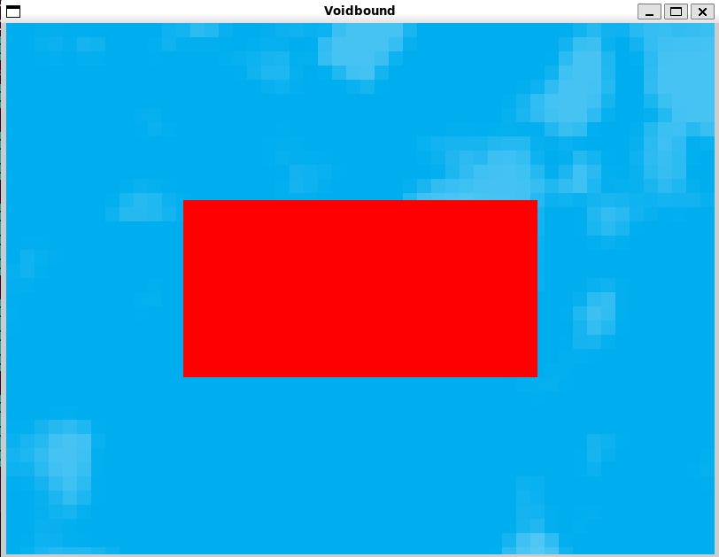

# Tutorial 2: Basic Drawing and Graphics

## Window Setup

To set up the game window using the Splashkit C++ framework, follow these steps:

1. Import the necessary Splashkit headers at the beginning of your code:

   ```cpp
   #include "splashkit.h"
   ```

1. In the `main` function, configure the game window, resolution, and initial screen:

   ```cpp
   int main()
   {
       open_window("Your Game Title", 800, 600);
       load_resource_bundle("game_resources", "your_resource_folder");

       // Set the initial screen (this can be a function call or game loop)
       // Example: set_initial_screen(menu_screen);

       return 0;
   }
   ```

## Drawing Rectangles

To draw rectangles using the Splashkit C++ framework, you can utilize the `fill_rectangle` function
provided by Splashkit's drawing library. This function allows you to create and fill rectangles on
the screen or a bitmap within your game loop or drawing function. Here's a detailed explanation of
how to use the `fill_rectangle` function:

1. **Function Syntax:**

   The `fill_rectangle` function has the following signature:

   ```cpp
   void fill_rectangle(color clr, double x, double y, double width, double height);
   ```

   - `clr`: The color of the rectangle to be drawn.
   - `x`: The horizontal position of the top-left corner of the rectangle.
   - `y`: The vertical position of the top-left corner of the rectangle.
   - `width`: The width of the rectangle.
   - `height`: The height of the rectangle.

1. **Example Usage:**

   Let's say you want to draw a red rectangle at coordinates `(100, 200)` with a width of `150` and
   a height of `100`. Here's how you would use the `fill_rectangle` function within your game loop
   or drawing function:

   ```cpp
   #include "splashkit.h"

   int main()
   {
       // Clear the screen with a sky blue background
       clear_screen(COLOR_SKY_BLUE);

       // Draw a red rectangle at coordinates (100, 200) with width 150 and height 100
       fill_rectangle(COLOR_RED, 100, 200, 150, 100);

       refresh_screen(); // Refresh the screen to display changes
   }
   ```

1. **Function Explanation:**

   The `fill_rectangle` function is a versatile tool for creating rectangular shapes in your game
   graphics. It fills the specified rectangle with the provided color, which can be any valid color
   from Splashkit's `color` data type. The `x` and `y` parameters determine the top-left corner of
   the rectangle's position on the screen or bitmap. The `width` and `height` parameters define the
   size of the rectangle.

   Keep in mind that the `fill_rectangle` function is just one of the drawing functions offered by
   Splashkit to create various shapes and graphics within your game scenes.

By using the `fill_rectangle` function effectively, you can add a variety of shapes to your game's
visual representation. This function, along with other drawing functions in the Splashkit library,
gives you the power to design dynamic and engaging game environments.

## Simple Backgrounds: Drawing and Loading Bitmaps

When implementing static, single-image backgrounds using the Splashkit C++ framework, the
`draw_bitmap` and `load_bitmap` functions play a key role in displaying and managing images within
your game scene. Here's an in-depth explanation of how to use these functions:

1. **Loading Bitmaps:**

   Before you can draw an image as a background or any other element, you need to load the image
   using the `load_bitmap` function. This function retrieves the image from a specified file and
   makes it available for use in your game.

   ```cpp
   bitmap load_bitmap(string name, string filename);
   ```

   - `name`: A unique name you assign to the loaded bitmap. You'll use this name to refer to the
     bitmap later.
   - `filename`: The path to the image file you want to load.

   Example:

   ```cpp
   bitmap background = load_bitmap("sky", "Resources/images/sky.png");
   ```

   This loads the image from the file "Resources/images/sky.png" and assigns it the name "sky" for
   future reference.

1. **Drawing Bitmaps:**

   Once you have loaded a bitmap, you can draw it on the screen using the `draw_bitmap` function.

   ```cpp
   void draw_bitmap(bitmap bmp, double x, double y);
   ```

   - `bmp`: The loaded bitmap you want to draw.
   - `x`: The x-coordinate where you want to place the bitmap on the screen.
   - `y`: The y-coordinate where you want to place the bitmap on the screen.

   Example:

   ```cpp
   draw_bitmap(background, 0, 0);
   ```

   This code draws the loaded "sky" bitmap at coordinates `(0, 0)` on the screen.

1. **Using Bitmaps in Your Game Loop:**

   To use the `load_bitmap` and `draw_bitmap` functions effectively, you typically integrate them
   into your game loop or drawing function. Here's a simplified example:

   ```cpp
   #include "splashkit.h"

   int main()
   {
       clear_screen(COLOR_WHITE); // Clear the screen with a white background

       // Load the background image from the specified path
       bitmap background = load_bitmap("sky", "Resources/images/sky.png");

       // Clear the screen with the loaded background image
       clear_screen();
       draw_bitmap(background, 0, 0);

       refresh_screen(); // Refresh the screen to display changes
   }
   ```

   This code loads the "sky" bitmap and draws it on a cleared screen, effectively setting it as the
   background.

By using the `load_bitmap` and `draw_bitmap` functions, you can seamlessly integrate images into
your game scenes and create engaging visual experiences for players. Whether it's a static
background or dynamic visual elements, Splashkit's bitmap handling functions provide the tools you
need to enhance your game's aesthetics.

## Putting it All together

Here's the complete code that combines all the steps we've discussed to create a simple Splashkit
program that opens a game window, displays a background image, draws a centered red rectangle, and
provides a brief pause for observation:

```cpp
#include "splashkit.h"

int main()
{
    // Declare variables for window dimensions
    int width = 800;
    int height = 600;

    // Open a game window with specified title and dimensions
    open_window("Voidbound", width, height);

    // Load the background image from the specified path
    bitmap background = load_bitmap("sky", "Resources/images/sky.png");
    // Clear the screen with the loaded background image
    clear_screen();
    draw_bitmap(background, 0, 0);

    // Declare variables for rectangle dimensions
    double w = 400;
    double h = 200;

    // Calculate the position to center the rectangle
    double x = width / 2 - w / 2;
    double y = height / 2 - h / 2;

    // Draw a filled red rectangle using calculated dimensions and position
    fill_rectangle(COLOR_RED, x, y, w, h);

    // Refresh the screen to display the drawn rectangle
    refresh_screen();

    // Pause execution for 2.5 seconds to observe the result
    delay(2500);

    // Close the game window
    close_all_windows();

    // Indicate successful program completion and return 0
    return 0;
}
```



**Explanation:**

This code is a complete example of how to create a simple Splashkit program that sets up a game
window, displays a background image, draws a centred red rectangle, and provides a brief pause for
observation before closing the window. The comments within the code provide explanations for each
step of the process.

By following this example and understanding the different elements used, you can create your own
Splashkit programs and expand upon them to build more complex games and interactive applications.
