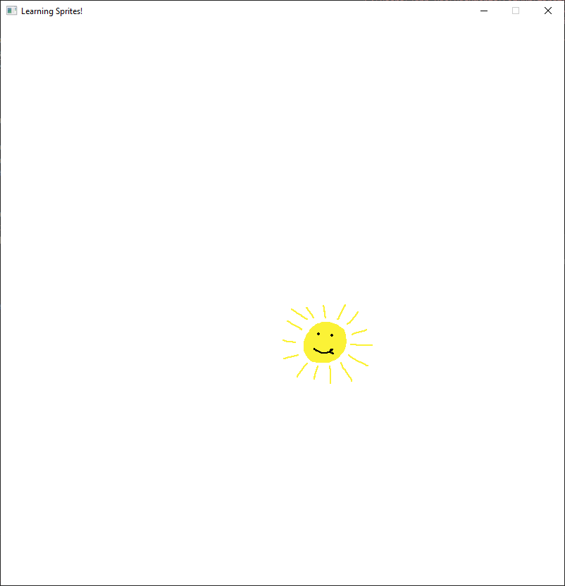
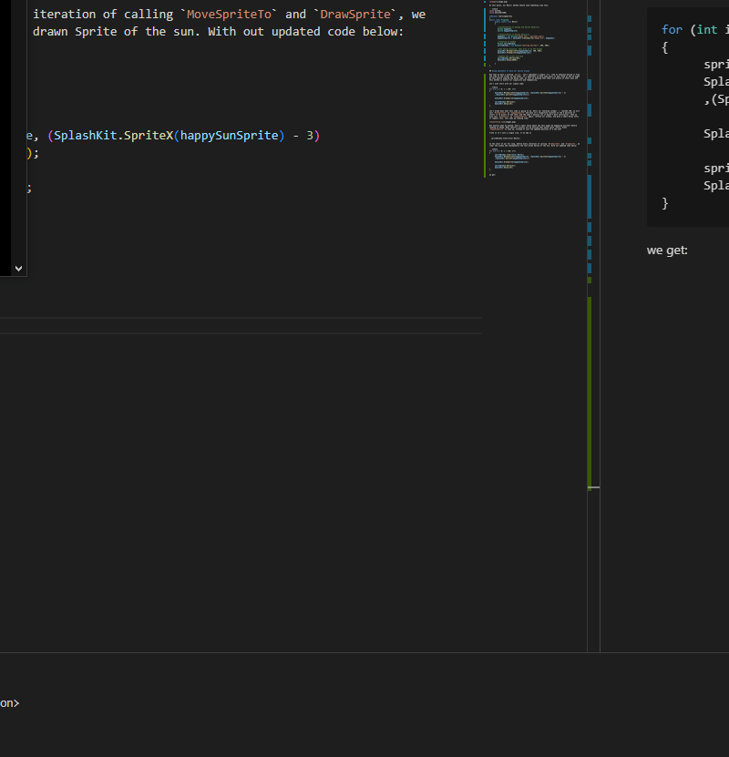

# Title: Getting Started With Sprites in Splashkit - C#

## What _is_ a Sprite in Splashkit?

A Sprite is a Bitmap. This is a bad answer to give, because the next question is, _what is a
bitmap?_ A bitmap is - in reductive terms, one of the methods of general image 'makeup' of all of
our digital images today, through which 'images' can be rendered. The other method is vector, but we
don't interact with those.

In order to be able to draw an image to a screen, we first have to provide some information to
Splashkit. We have to have Bitmap images to pass into our
[Create Sprite](https://splashkit.io/api/sprites/#create-sprite) function so that it can create a
workable _Sprite_ file type for us. This looks something like this inside our Main() method:

```csharp
Private Bitmap happySun;
Private Sprite happySunSprite;
```

Line by line, this can be broken down as:

1. Instantiate a new Object happySun, of Type [Bitmap](https://splashkit.io/api/types/#bitmap)

```csharp
Bitmap HappySun;
```

Relevant overloads are shown below, we pass in a string name, and we can either give a filename to
assign from a file or URL we have access to, or denote an int for width and height to have a
workable 'empty' sprite.

```csharp
Bitmap(string name, string file);
```

```csharp
Bitmap(string name, int width int height);
```

2. Instantiate a new `Object happySunSprite`, of `Type Sprite`

   ```csharp
   Sprite happySunSprite;
   ```

1. Assign to `Object happySunSprite` the loaded `Bitmap happySun`, using one of the overloaded
   [Create Sprite](https://splashkit.io/api/sprites/#create-sprite) methods, specifically
   [the method where we provide a String and a Bitmap object](https://splashkit.io/api/sprites/#create-sprite-named)

```csharp
         HappySun = new Bitmap("Happy Sun", "sprite01.png");
         HappySunSprite = SplashKit.CreateSprite("Happy Sun", happySun);
```

After these steps, we now have an instantiated Bitmap and Sprite for us to play with.

## Playing With Sprites in Splashkit

So we have a Sprite, `happySunSprite` (or whatever you have named yours.) Let's create a small scene
to show it off. We'll start with creating a `Window` object for us to draw it onto. This can follow
after the pervious lines in our Main() method.

```csharp
Window SpriteWindow;
spriteWindow = new Window("Learning Sprites!, 800, 800);
```

As above, we create a new `Object` of type `Window` (this is important because Splashkit has
specific implementation for multi-window and window-specific method handling), and then we assign
that value with the window title of "Learning Sprites!", and give it x and y size integers, using
[Open Window](https://splashkit.io/api/windows/#open-window).

If we were to run and compile our code now for reference, it should open up an 800x800 window, of
title 'Learning Sprites!', but with nothing on the screen. In order to remedy this, we can make use
of the [Move Sprite To](https://splashkit.io/api/sprites/#move-sprite-to) and
[Draw Sprite](https://splashkit.io/api/sprites/#group-draw-sprite) methods as below:

```csharp
SplashKit.MoveSpriteTo(happySunSprite, 400, 400);
SplashKit.DrawSprite(happySunSprite);
```

You might be wondering why we _move_ our sprite _before_ we draw it. In this instance, this is just
for clarity purposes and to have our image pop up in the middle of our window, but for future
references, if not otherwise moved with appropriate methods, `Sprites` begin at the origin of a
given SplashKit `Window` (0,0 coordinates.) You can go ahead and remove the `MoveSpriteTo` method
yourself and see this if at all interested. It's important to note that in cases where you don't
want a `Sprite` to be seen at Origin point first, to move them and then Draw them to our window.

If you go ahead and compile and run the above command, you'll still see nothing in the window. This
is because we still have to do a basic
[Window Refresh](https://splashkit.io/api/windows/#refresh-window) to 'update' or 'paint' what
Sprites and where we have told SplashKit to put them. After you add these lines to our Main() :

```csharp
spriteWindow.Refresh(60);
SplashKit.Delay(5000);
```

You will see our little `Sprite` sitting there in the window.



At this point, our Main() method should look something like this:

```csharp
using System;
using SplashKitSDK;

namespace learningSprites
{
      public class Program{
            public static void Main()
            {

            //Instantiation of Bitmap and Sprite Object(s)
            Bitmap happySun;
            Sprite happySunSprite;

            //Instantiation of Sprite Object(s)
            happySun = new Bitmap("Happy Sun", "sprite01.png");
            happySunSprite = SplashKit.CreateSprite("Happy Sun", happySun);

            //Creation of Window
            Window spriteWindow;
            spriteWindow = new Window("Learning Sprites!", 800, 800);

            //Set Sprite position, then draw it to the window
            SplashKit.MoveSpriteTo(happySunSprite, 400, 400);
            SplashKit.DrawSprite(happySunSprite);

            //Update the screen and hold
            spriteWindow.Refresh(60);
            SplashKit.Delay(5000);

            }
      }
}
```

## Using Splashkit to move our Sprite around

Now that we have a working `Sprite`, let's implement a simple `For` loop to showcase moving it from
one side of the screen to the other. It's important to have some basis in your mind of how we might
do this before copying the below code, as well as knowing that their are plenty of other ways and
this method is mostly for simplicity and readability.

Let's just start with our simple code:

```csharp
for (int i = 0; i < 150; i++)
{
      SplashKit.MoveSpriteTo(happySunSprite, (SplashKit.SpriteX(happySunSprite) - 3)
      ,(SplashKit.SpriteY(happySunSprite)));

      SplashKit.DrawSprite(happySunSprite);

      spriteWindow.Refresh();
      SplashKit.Delay(10);
}
```

Let's break down what this code is going to do. Until our checking integer `i` reached 150, we will
call `MoveSpriteTo` on `happySunSprite` and move it's respective location to the X position of
itself -3 (3 pixels to the left) and the same Y postion (so it doesn't move vertically). Then we
just call `DrawSprite` on `happySunSprite` again, refresh our window, and give a small delay until
it repeats this. This ends up looking like:


Not exactly what we wanted, have a small think about why this might be happening yourself before
reading on ahead. What specific process are we missing that would cause _every_ drawn
`happySunSprite` to show up, instead of just the updated position of a new one?

Truth is it's just a single line, if we add in

```
  spriteWindow.Clear(Color.White);
```

to the start of our for loop, before every iteration of calling `MoveSpriteTo` and `DrawSprite`, we
clear the window and subsequently the last drawn Sprite of the sun. With out updated code below:

```csharp
for (int i = 0; i < 150; i++)
{
      spriteWindow.Clear(Color.White);
      SplashKit.MoveSpriteTo(happySunSprite, (SplashKit.SpriteX(happySunSprite) - 3)
      ,(SplashKit.SpriteY(happySunSprite)));

      SplashKit.DrawSprite(happySunSprite);

      spriteWindow.Refresh();
      SplashKit.Delay(10);
}
```

we get:



And there we go. A basic and simple tutorial outling creation and modification of Sprite objects in
SplashKit. Remember it's important to do practical self-taught projects and lessons to incentivize
learning and memory building. Try and have the Sun react to a button input, or move vertically, or
even change Sprites once it's reached a certain position!

Our final code snippet:

```csharp
using System;
using SplashKitSDK;

namespace learningSprites
{
public class Program{
      public static void Main()
      {

            //Instantiation of Bitmap and Sprite Object(s)
            Bitmap happySun;
            Sprite happySunSprite;

            //Instantiation of Sprite Object(s)
            happySun = new Bitmap("Happy Sun", "sprite01.png");
            happySunSprite = SplashKit.CreateSprite("Happy Sun", happySun);

            //Creation of Window
            Window spriteWindow;
            spriteWindow = new Window("Learning Sprites!", 800, 800);

            //Set Sprite position, then draw it to the window
            SplashKit.MoveSpriteTo(happySunSprite, 400, 400);
            SplashKit.DrawSprite(happySunSprite);

            //    //Update the screen and hold
            //    spriteWindow.Refresh(60);
            //    SplashKit.Delay(5000);

            //Loop through and iterate happySunSprite position
            for (int i = 0; i < 150; i++)
            {
                  spriteWindow.Clear(Color.White);
                  SplashKit.MoveSpriteTo(happySunSprite, (SplashKit.SpriteX(happySunSprite) - 3)
                  ,(SplashKit.SpriteY(happySunSprite)));

                  SplashKit.DrawSprite(happySunSprite);

                  spriteWindow.Refresh();
                  SplashKit.Delay(10);
            }

            }
      }
}
```
