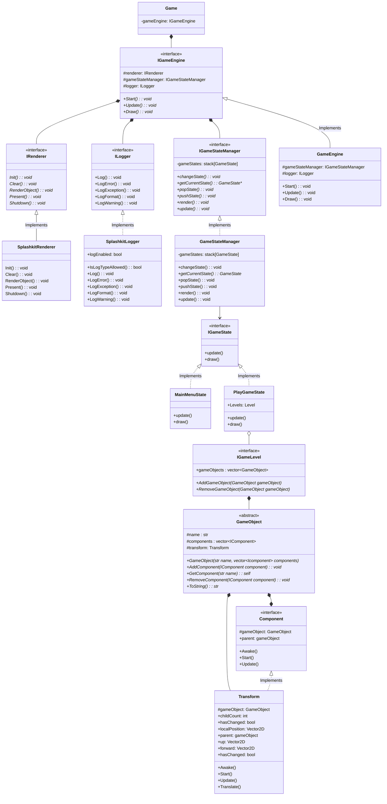
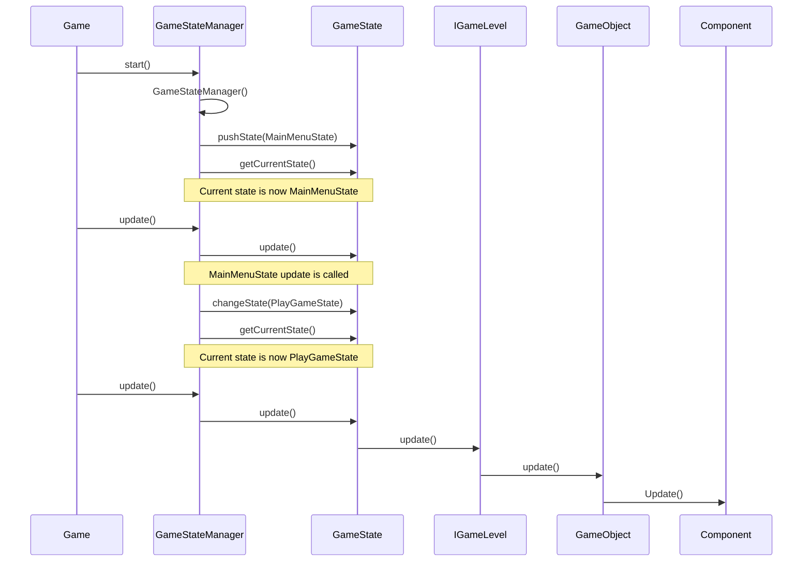

## Software Requirements Specification for Mario-Like Game Tutorial Using Splashkit

### 1. Purpose Description

The purpose of this game tutorial is to create an engaging and educational Mario-like game that
utilizes various functionalities of Splashkit.

The tutorial aims to teach users how to implement key game mechanics and features, such as character
movement, collision detection, sprite animation, and interactive gameplay.

By building this game, users will gain hands-on experience with Splashkit's capabilities and learn
how to apply them effectively in real-world game development scenarios.

### 2. Features

The Mario-like game tutorial will include the following **features**:

1. **Character Movement**: Implementing smooth movement for the main character using keyboard input.
1. **Collision Detection**: Handling collisions between the main character and other game objects,
   such as obstacles and enemies.
1. **Sprite Animation**: Creating animations for the main character, enemies, and other in-game
   elements using Splashkit's animation functionalities.
1. **Interactive Gameplay**: Designing interactive elements like collectible items, power-ups, and
   enemies to provide an engaging gaming experience.
1. **Scoring System**: Implementing a scoring mechanism to track and display the player's progress.
   _Stretch_: different scene via states system
1. **Audio Integration**: Incorporating sound effects and background music using Splashkit's audio
   functionalities.
1. **Level Design**: Creating multiple levels with increasing difficulty and unique challenges.

#### Stretch Features

Menu system to start the game. Utilizes mouse input and States to change scenes using Splashkit game
engine.

### 3. User Case

As a user, I want to follow the Mario-like game tutorial to **learn how to develop** a game using
Splashkit's functionalities effectively.

---

The tutorial should provide step-by-step instructions on implementing key game mechanics, including
character movement, collision detection, sprite animation, interactive gameplay, scoring system,
audio integration, and level design. By engaging in the tutorial, I aim to gain practical experience
in game development with Splashkit, understand its features, and apply the learned knowledge to
create my own games with similar functionalities.

---

**Stretch User story**

As a prospective Deakin University student, I want to play the Mario-like game developed using
Splashkit at the Deakin Arcade Showcase, so that I can experience and appreciate the programming
skills showcased at Deakin and get inspired to learn programming myself.

### 4. Class Diagram

This is a high-level plan of the game

### 5. Sequence Diagrams

