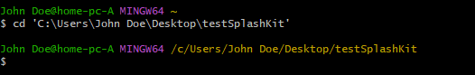

# Getting Started With SplashKit - Windows C#/C++

## Initial install

The first step to interacting with SplashKit on your system is to
[install the MSYS2 unix terminal environment](https://www.msys2.org/). Leave all values as default,
and don't install onto a PATH (install location) that has spaces in it.

Then open your newly-installed MSYS2 terminal, and install the git client via the following command:

```
pacman -S git --noconfirm --disable-download-timeout
```

You can copy this code from this document and paste into the MSYS2 client by either right-clicking
and pasting, or using the shift+insert command.

The next step is to actually run the install script for SplashKit itself, still in MSYS2, with the
following command:

```
bash <(curl -s https://raw.githubusercontent.com/splashkit/skm/master/install-scripts/skm-install.sh)
```

To make sure everything has worked, you can restart your terminal, run `skm` as a command (just
those letters, it acts as a call), and you should see the following message:

```
Splashkit is installed successfully!
Missing skm command. For help use 'skm help'
```

## VSCode and Language Tools

Assuming everything from above has worked, the next steps are comparatively easier. Just
[install Visual Studio Code](https://code.visualstudio.com/) for a start. For the rest of this
guide, we'll be installing and focusing on C#/C++ language install procedures and compile / creation
routines.

For C#, this process involves opening your MSYS2 terminal again, and running the following command:

```
pacman -S mingw-w64-{x86_64,i686}-gcc mingw-w64-{i686,x86_64}-gdb
```

Then going to the [.NET Core SDK](https://dotnet.microsoft.com/en-us/download) download page and
installing it. That's it for C#. For a little added functionality such as Intellisense and code
formatting, install the C# extension in Visual Studio Code as well. This can be done by clicking on
the 4 boxes icon on the bottom of the top left menu, near the magnifying glass, and just typing C#
and clicking install.

For C++, if you've already run the code snippet above, nothing has to be done. Otherwise, run that
code snippet as well, and then simply install the C++ extension in Visual Studio Code, just like for
C#.

## Creation and Compiling

This is the fun part. You've installed some language tools, and SplashKit itself. Now the question
is "How do we actually _make_ something?" In order to set up the necessary files and dependencies
for SplashKit project creation, all you have to do is:

1. Navigate to a folder to act as a base, as an example my folder path will be
   `C:\Users\{User}\Desktop\testSplashKit`

1. Once there, open a MSYS2 terminal and navigate to that folder with the `cd` (change directory)
   command. Either by copy-pasting the path in the windows explorer by just clicking it, or typing
   it. You'll know you are in the right position because the location line will change from `~` to
   your location, like below:

   

1. Once you have navigated the MSYS2 terminal to the base location that you want your project to be
   in, you can run either of the following commands:

   1. For C#, the command is `skm dotnet new`, which will intialize some VSCode settings, create a
      Program.cs file to initially edit, as well as a .csproj file to open

   1. For C++, the command is `skm new c++`, which will do the same as above, but initialize a cpp
      file instead

1. After having created your project files to edit, and assumedly editing them with some amount of
   code, the process to compile and run are as follows:

   1. For C#, `skm dotnet run` will compile and run but not output an exe, for that functionality
      you run `skm dotnet publish` and navigate to the created bin folder file structure to find the
      output.

   1. For C++, `skm clang++ program.cpp` will output an exe compiled and ready to run, can be
      ammended with an `-O` parameter to give a file name, such as
      `skm clang++ program.cpp -o SpriteLayering` giving you a SpriteLayering.exe
