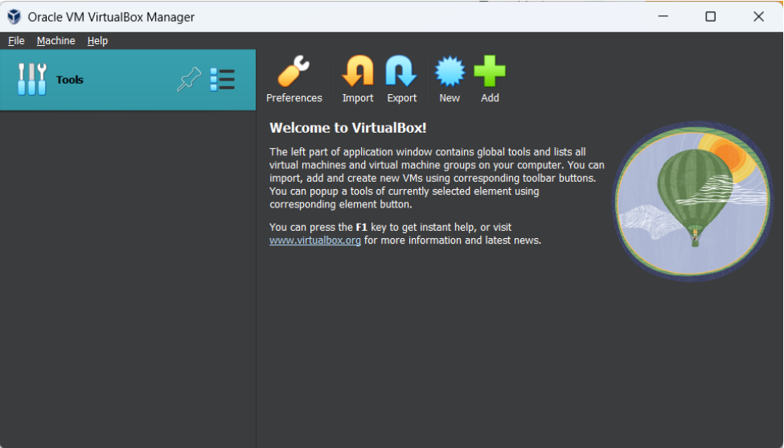
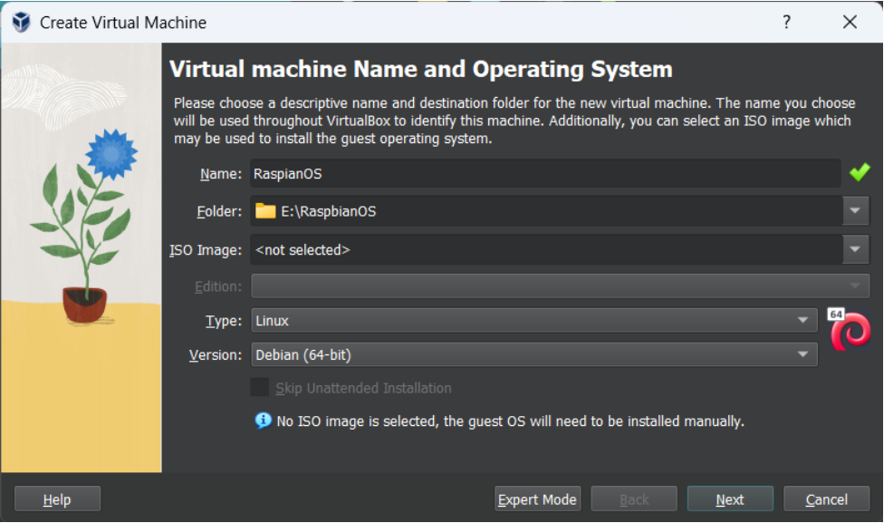

# PI Emulation (Raspbian OS virtually)

To test your games for the arcade machine when you don't have access to a Raspberry Pi or the arcade
machine, you can set up a virtual environment using VirtualBox and emulate the Raspberry Pi 3 B+.
Here's a short guide on how to do it:

1. Install VirtualBox (or virtual machines).
1. Install Raspbian OS on the virtual machine.
1. Install Splashkit sdk on the Raspbian machine.

Steps:

## Install VirtualBox:

1. Download the VirtualBox installer from their official wiki page
   [here](https://www.virtualbox.org/wiki/Downloads).
1. Choose the installer for your operating system (Windows, Linux, or Mac).
1. Run the installer and follow the on-screen instructions to install VirtualBox on your computer.
   

## Download Raspberry Pi OS Desktop ISO:

1. Go to the Raspberry Pi download page
   [here](https://www.raspberrypi.com/software/raspberry-pi-desktop/) and navigate to the Raspberry
   Pi Desktop section.
1. Click on the "Download" button to directly download the Raspberry Pi OS Desktop ISO file. (Note:
   ISO size may exceed over 3 GB.)
1. Alternatively, you can choose to download the ISO file using a Torrent client if you have one
   installed.

## Create a new virtual machine for Raspberry Pi OS Desktop:

1. Launch VirtualBox and click on the "New" button to create a new virtual machine.
1. Give your virtual machine a name, such as "Raspberry Pi OS Desktop." Choose the directory, wher
   you want the virtual machine to be installed on. (Note: Disk sould have enough space)
1. Choose the operating system as Linux and select Debian (64-bit) as the version
   

1. Allocate an appropriate amount of RAM for your virtual machine. _The least recommended size is
   1GB, but you can allocate more if your computer has enough resources._
1. Configure the number of CPUs allocated to your virtual machine. _Using 2 to 4 cores is
   recommended if your machine has 4 or 8 cores._ 

1. Create a virtual hard disk for your virtual machine. _Choose the default options unless you have
   specific requirements._
1. Allocate enough disk space for your virtual machine. _It is recommended to allocate at least 15
   to 25GB depending on your usage._ 

1. Click Next, recheck everything as similar to the steps above in the configuration summary. Click
   on `Finish`. 

1. Click on settings. Choose Display. Tick Enable 3D acceleration. Allocate 128 MB video memory.
    _Now you have a virtual box configured. Lets Move to installation of
   Raspbian OS._
1. Associate the Raspberry Pi OS Desktop ISO file you downloaded with your virtual machine.

   1. Click on Storage.
   1. Choose Empty under “Controller:IDE”.
   1. Click on disk icon.

   

   1. Browse the Raspbian OS ISO, we just downloaded.
   1. Click `“OK”`.

## Install Raspberry Pi OS Desktop on your virtual machine:

1. Start your Raspberry Pi OS Desktop virtual machine by clicking on the "Start" button in
   VirtualBox.
1. Select “Graphical install”. Follow the on-screen instructions. Choose Guided - use entire disk.

1. Select “All files in one partition”.

1. Choose the language, partition disks, and configure other settings as per your preferences.
1. Once the installation is complete, your Raspberry Pi OS Desktop virtual machine is ready to use.
   

## Install SplashKit SDK:

1. Follow the instructions provided by SplashKit to install the SDK. You can refer to the official
   SplashKit documentation [here](https://splashkit.io/articles/installation/ubuntu/) for detailed
   installation steps .
