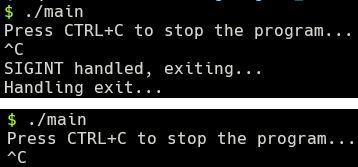

# \*\*Spike Outcomes

==================

**Title:** Exit Handling in SplashKit.

**Author:** Jonathan Tynan

## Goals / Deliverables

- Short Report titled “Exit Handling in SplashKit.”

## Tasks undertaken

List key tasks likely to help another developer

- Perform research into automatic cleanup upon exiting a SplashKit program.
- Document this research.

## What we found out

Certain resources that SplashKit uses, such as Bitmaps, require freeing before exiting of the program. If they are not freed, then a segmentation fault can occur. Is there a way for SplashKit to automatically handle the cleanup of these resources?

A C++ program can exit in several ways, such as once the `main()` function returns, or a call to `exit()` is performed. They can be interrupted with signals such as `SIGINT` and `SIGTERM`, or they can exit abnormally -- which is when a program will 'crash'. A segmentation fault is an example of this.

C++ provides the `atexit()` function, which allows us to register a function to occur upon program exit. This means we can create a function to free all resources, register it when we initialise the SplashKit SDK, and have this function run when `main()` returns or `exit()` is called.

`SIGINT` occurs primarily when the user presses `CTRL-C` in their terminal, interrupting the program. Similarly, `SIGTERM` terminates the program and could be sent by an external program. C++ also provides mechanisms to register functions to handle signals too, here is an example:

```cpp
#include <iostream>
#include <csignal>
#include <cstdlib>

void handle_sigint(int signal)
{
  std::cout << "\nSIGINT handled, exiting..." << std::endl;
  exit(0);
}

void handle_exit()
{
  std::cout << "Handling exit..." << std::endl;
}

int main()
{
  // Register handle_sigint for SIGINT
  std::signal(SIGINT, handle_sigint); 
  // Register handle_exit for program exit
  std::atexit(handle_exit);
  
  std::cout << "Press CTRL+C to stop the program..." << std::endl;
  
  while(true) {}
  
  std::cout << "This should never be reached." << std::endl;
  
  return 0;
}
```

Run this and once you use CTRL+C you'll see `handle_sigint` and `handle_exit` be called, but the last line is never reached. Run it again with the line `std::signal(SIGINT, handle_sigint);` commented out and you'll see that no messages are printed after "Press CTRL+C to stop the program...". This is demonstrated below.



There are other signals and ways to catch a programs exit, but these (such as `SIGABRT`) only occur in 
abnormal situations, and thus we should _not_ handle these signals.

Relatively simply, we can register particular functions to perform our own cleanup and in doing so can prevent situations in which errors such as `SEGMENTATION FAULT` can occur.

## Risks

- There is a risk that a program is used/created that never calls the `internal_sk_init` function that these registrations should occur in, and thus our cleanup never occurs. Keeping in mind that this is something we're not doing already, this risk is minor.
- It is undefined behaviour to call `exit()` in a function registered with `atexit()`. _Do not do this._

## Recommendations

- A function is created that will call all resource-freeing functions, such as `close_all_windows()`.
  - This function _should not call_ `exit()`.
  - This function is registered using `atexit()` inside `internal_sk_init()`.
- A signal handler function is created that will just call `exit(0)` -- passing in 0 as the exit code.
  - This function is registered to `SIGINT` inside `internal_sk_init()`.
  - This function could also be registered to handle `SIGTERM`, if appropriate.
